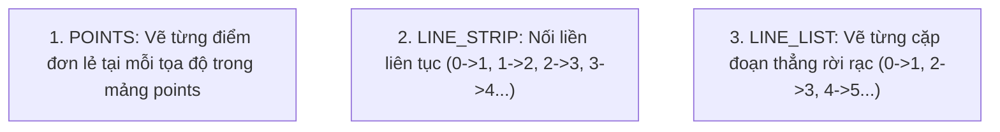

---
tags:
  - ros2
  - rviz2
  - markers
  - points
  - line_strip
  - line_list
  - helix-animation
  - cpp
  - intermediate
created: 2026-08-25
aliases:
  - Vẽ Điểm và Đường thẳng với Marker trong C++
  - Marker: Points and Lines (C++)
---

# 📈 Vẽ Điểm và Đường thẳng với Marker trong C++ (Points & Lines)

> [!INFO] **Mục tiêu bài học**
> Học cách sử dụng mảng tọa độ `points` trong bản tin `visualization_msgs/msg/Marker` để vẽ hàng loạt điểm rời rạc (**`POINTS`**), chuỗi đường gấp khúc nối liền (**`LINE_STRIP`**) và tập hợp các đoạn thẳng độc lập (**`LINE_LIST`**) để tạo hiệu ứng hình xoắn ốc (Helix) chuyển động 3D.
> - **Cấp độ:** Intermediate
> - **Thời lượng ước tính:** 15 phút
> - **Bài trước:** [[02 - Sending Basic Shape Markers to RViz (C++)|Gửi Marker Hình học Cơ bản lên RViz2 (C++)]]
> - **Bài tiếp theo:** [[04 - RViz Marker Display Types Reference|Bảng Tra cứu Toàn bộ 12 Loại Marker trong RViz]]

---

## 📖 Bối cảnh & 3 Loại Marker Mảng Điểm

Khi cần trực quan hóa quỹ đạo di chuyển (Trajectory), đám mây điểm cảm biến thu nhỏ, hoặc các tia phát hiện va chạm:



| Loại Marker | Cơ chế hoạt động của mảng `points` | Ý nghĩa của `scale` |
| :--- | :--- | :--- |
| **`POINTS`** | Đặt 1 điểm hình cầu/vuông tại mỗi phần tử | `scale.x`: Chiều rộng điểm, `scale.y`: Chiều cao điểm. |
| **`LINE_STRIP`** | Vẽ đường nối tiếp liên tục qua các điểm | `scale.x`: Độ dày nét vẽ của đường thẳng. |
| **`LINE_LIST`** | Cứ mỗi 2 điểm liên tiếp tạo thành 1 đoạn thẳng rời rạc | `scale.x`: Độ dày nét vẽ của đoạn thẳng. |

---

## 🛠️ Triển khai mã nguồn C++ (`points_and_lines.cpp`)

```cpp
#define _USE_MATH_DEFINES
#include <chrono>
#include <cmath>
#include <memory>

#include "geometry_msgs/msg/point.hpp"
#include "rclcpp/rclcpp.hpp"
#include "visualization_msgs/msg/marker.hpp"

using namespace std::chrono_literals;

int main(int argc, char ** argv)
{
  rclcpp::init(argc, argv);
  auto node = rclcpp::Node::make_shared("points_and_lines");
  auto marker_pub = node->create_publisher<visualization_msgs::msg::Marker>(
    "visualization_marker", 10
  );
  rclcpp::Rate loop_rate(30); // 30 Hz để tạo hoạt họa mượt mà

  float f = 0.0f; // Góc pha chuyển động

  while (rclcpp::ok()) {
    visualization_msgs::msg::Marker points, line_strip, line_list;
    
    // Header chung
    auto now = node->get_clock()->now();
    points.header.frame_id = line_strip.header.frame_id = line_list.header.frame_id = "my_frame";
    points.header.stamp = line_strip.header.stamp = line_list.header.stamp = now;
    points.ns = line_strip.ns = line_list.ns = "points_and_lines";
    points.action = line_strip.action = line_list.action = visualization_msgs::msg::Marker::ADD;
    
    // Đặt ID độc nhất cho 3 marker
    points.id = 0;
    line_strip.id = 1;
    line_list.id = 2;

    // Gán kiểu Marker
    points.type = visualization_msgs::msg::Marker::POINTS;
    line_strip.type = visualization_msgs::msg::Marker::LINE_STRIP;
    line_list.type = visualization_msgs::msg::Marker::LINE_LIST;

    // Kích thước (Scale)
    points.scale.x = 0.2;
    points.scale.y = 0.2;

    line_strip.scale.x = 0.1; // Độ dày đường nối
    line_list.scale.x = 0.1;  // Độ dày tia thẳng

    // Màu sắc: Điểm Xanh lá, LineStrip Xanh dương, LineList Đỏ
    points.color.g = 1.0f;
    points.color.a = 1.0f;

    line_strip.color.b = 1.0f;
    line_strip.color.a = 1.0f;

    line_list.color.r = 1.0f;
    line_list.color.a = 1.0f;

    // Tính toán tọa độ 100 điểm theo đường xoắn ốc Helix
    for (uint32_t i = 0; i < 100; ++i) {
      float y = 5.0f * sin(f + i / 100.0f * 2.0f * M_PI);
      float z = 5.0f * cos(f + i / 100.0f * 2.0f * M_PI);

      geometry_msgs::msg::Point p;
      p.x = static_cast<int32_t>(i) - 50;
      p.y = y;
      p.z = z;

      // Nạp vào Points và LineStrip
      points.points.push_back(p);
      line_strip.points.push_back(p);

      // LineList cần 2 điểm cho mỗi đoạn thẳng (tạo tia thẳng đứng theo Z)
      line_list.points.push_back(p);
      p.z += 1.0f;
      line_list.points.push_back(p);
    }

    // Xuất bản cả 3 Marker
    marker_pub->publish(points);
    marker_pub->publish(line_strip);
    marker_pub->publish(line_list);

    loop_rate.sleep();
    f += 0.04f; // Tăng góc pha tạo hiệu ứng xoay
  }

  rclcpp::shutdown();
  return 0;
}
```

---

## 📌 Tóm tắt (Summary)
- Sử dụng mảng `marker.points.push_back(p)` cho phép vẽ hàng trăm/nghìn điểm và đoạn thẳng chỉ trong một bản tin duy nhất, giúp tối ưu hiệu năng đồ họa cực cao so với việc gửi lẻ từng marker riêng biệt.

---

## 🔗 Liên kết & Bài tiếp theo
- ⬅️ Bài trước: [[02 - Sending Basic Shape Markers to RViz (C++)|Gửi Marker Hình học Cơ bản lên RViz2 (C++)]]
- ➡️ Bài tiếp theo: [[04 - RViz Marker Display Types Reference|Bảng Tra cứu Toàn bộ 12 Loại Marker trong RViz]]
