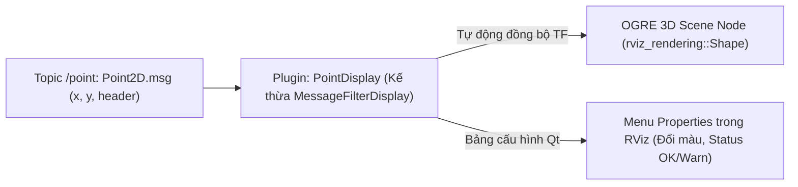

---
tags:
  - ros2
  - rviz2
  - plugins
  - pluginlib
  - custom-display
  - qt
  - ogre
  - cpp
  - intermediate
created: 2026-08-25
aliases:
  - Tự Xây dựng Custom RViz Display Plugin trong C++
  - Building a Custom RViz Display
---

# 🎨 Tự Xây dựng Custom RViz Display Plugin trong C++ (Display Plugin)

> [!INFO] **Mục tiêu bài học**
> Học cách viết một **Plugin Hiển thị Tùy biến (Custom Display Plugin)** cho RViz2 bằng C++: kế thừa lớp `rviz_common::MessageFilterDisplay`, tương tác với engine đồ họa **OGRE** (`rviz_rendering::Shape`), tạo bảng thuộc tính màu sắc với **Qt** (`ColorProperty`), báo cáo trạng thái (`StatusProperty`) và đăng ký plugin động với **`pluginlib`**.
> - **Cấp độ:** Intermediate
> - **Thời lượng ước tính:** 25 phút
> - **Bài trước:** [[04 - RViz Marker Display Types Reference|Bảng Tra cứu Toàn bộ 12 Loại Marker trong RViz]]
> - **Bài tiếp theo:** [[06 - Building a Custom RViz Panel Plugin (C++)|Tự Xây dựng Custom RViz Panel Plugin (C++)]]

---

## 📖 Bối cảnh (Background)

Khi bạn tự định nghĩa các kiểu tin nhắn tùy biến (ví dụ: `Point2D.msg`, `SonarScan.msg`, `RadarTracks.msg`), RViz2 chưa có sẵn Display tương ứng. 

Thay vì phải chuyển đổi sang `Marker`, việc viết một **RViz Display Plugin** chuyên dụng mang lại hiệu năng render tối ưu nhất và trải nghiệm người dùng chuyên nghiệp (có menu cấu hình thuộc tính riêng).



---

## 🛠️ Triển khai mã nguồn C++

### 1. File Khai báo Header (`include/rviz_plugin_tutorial/point_display.hpp`)

```cpp
#ifndef RVIZ_PLUGIN_TUTORIAL__POINT_DISPLAY_HPP_
#define RVIZ_PLUGIN_TUTORIAL__POINT_DISPLAY_HPP_

#include <memory>
#include <rviz_common/message_filter_display.hpp>
#include <rviz_common/properties/color_property.hpp>
#include <rviz_common/properties/status_property.hpp>
#include <rviz_rendering/objects/shape.hpp>
#include <rviz_plugin_tutorial_msgs/msg/point2_d.hpp>

namespace rviz_plugin_tutorial
{
class PointDisplay
  : public rviz_common::MessageFilterDisplay<rviz_plugin_tutorial_msgs::msg::Point2D>
{
  Q_OBJECT // Bắt buộc để sử dụng cơ chế Signal/Slot của Qt

public:
  PointDisplay() = default;
  ~PointDisplay() override = default;

protected:
  // Khởi tạo đối tượng 3D khi Display được nạp vào RViz
  void onInitialize() override;

  // Xử lý dữ liệu khi có thông điệp mới đến và đã đồng bộ TF thành công
  void processMessage(const rviz_plugin_tutorial_msgs::msg::Point2D::ConstSharedPtr msg) override;

private Q_SLOTS:
  // Callback Qt khi người dùng thay đổi màu sắc trên menu
  void updateStyle();

private:
  std::unique_ptr<rviz_rendering::Shape> point_shape_;
  std::unique_ptr<rviz_common::properties::ColorProperty> color_property_;
};
} // namespace rviz_plugin_tutorial

#endif // RVIZ_PLUGIN_TUTORIAL__POINT_DISPLAY_HPP_
```

---

### 2. File Hiện thực Mã nguồn (`src/point_display.cpp`)

```cpp
#include "rviz_plugin_tutorial/point_display.hpp"
#include <rviz_common/logging.hpp>
#include <rviz_common/properties/parse_color.hpp>
#include <rviz_common/display_context.hpp>
#include <rviz_common/frame_manager_iface.hpp>
#include <pluginlib/class_list_macros.hpp>

namespace rviz_plugin_tutorial
{

void PointDisplay::onInitialize()
{
  MFDClass::onInitialize();

  // 1. Tạo hình hộp 3D trong OGRE Scene Node
  point_shape_ = std::make_unique<rviz_rendering::Shape>(
    rviz_rendering::Shape::Type::Cube,
    scene_manager_,
    scene_node_
  );

  // 2. Tạo thuộc tính ColorProperty cho người dùng chọn màu trên GUI
  color_property_ = std::make_unique<rviz_common::properties::ColorProperty>(
    "Point Color",
    QColor(36, 64, 142), // Màu mặc định
    "Màu sắc để vẽ điểm 2D trên không gian 3D",
    this,
    SLOT(updateStyle())
  );

  updateStyle();
}

void PointDisplay::updateStyle()
{
  // Chuyển đổi mã màu Qt (QColor) sang mã màu OGRE (ColourValue)
  Ogre::ColourValue color = rviz_common::properties::qtToOgre(color_property_->getColor());
  point_shape_->setColor(color);
}

void PointDisplay::processMessage(const rviz_plugin_tutorial_msgs::msg::Point2D::ConstSharedPtr msg)
{
  // 1. Biến đổi tọa độ của message sang Fixed Frame hiện tại của RViz
  Ogre::Vector3 position;
  Ogre::Quaternion orientation;
  if (!context_->getFrameManager()->getTransform(msg->header, position, orientation)) {
    RVIZ_COMMON_LOG_DEBUG_STREAM("Lỗi biến đổi frame '" << msg->header.frame_id << "' sang '" << qPrintable(fixed_frame_) << "'");
    return;
  }

  scene_node_->setPosition(position);
  scene_node_->setOrientation(orientation);

  // 2. Cập nhật vị trí điểm 3D
  Ogre::Vector3 point_pos(msg->x, msg->y, 0.0);
  point_shape_->setPosition(point_pos);
  point_shape_->setScale(Ogre::Vector3(0.2, 0.2, 0.2));

  // 3. Báo cáo trạng thái: Cảnh báo nếu tọa độ X âm
  if (msg->x < 0) {
    setStatus(rviz_common::properties::StatusProperty::Warn, "Message", "Tọa độ X âm!");
  } else {
    setStatus(rviz_common::properties::StatusProperty::Ok, "Message", "Tọa độ hợp lệ.");
  }
}

} // namespace rviz_plugin_tutorial

// Đăng ký Plugin vào hệ thống pluginlib của ROS 2
PLUGINLIB_EXPORT_CLASS(rviz_plugin_tutorial::PointDisplay, rviz_common::Display)
```

---

### 3. File Đăng ký Plugin (`rviz_common_plugins.xml`)

```xml
<library path="point_display">
  <class name="Point2D" type="rviz_plugin_tutorial::PointDisplay" base_class_type="rviz_common::Display">
    <description>Plugin trực quan hóa kiểu tin nhắn Point2D</description>
    <message_type>rviz_plugin_tutorial_msgs/msg/Point2D</message_type>
  </class>
</library>
```

---

### 4. Cấu hình `CMakeLists.txt` với Qt MOC

```cmake
find_package(ament_cmake_ros REQUIRED)
find_package(pluginlib REQUIRED)
find_package(rviz_common REQUIRED)
find_package(rviz_rendering REQUIRED)
find_package(rviz_plugin_tutorial_msgs REQUIRED)

# Kích hoạt trình biên dịch tự động của Qt (MOC)
set(CMAKE_AUTOMOC ON)
qt5_wrap_cpp(MOC_FILES
  include/rviz_plugin_tutorial/point_display.hpp
)

add_library(point_display SHARED src/point_display.cpp ${MOC_FILES})
target_include_directories(point_display PUBLIC
  $<BUILD_INTERFACE:${CMAKE_CURRENT_SOURCE_DIR}/include>
  $<INSTALL_INTERFACE:include>
)
target_link_libraries(point_display PUBLIC
  pluginlib::pluginlib
  rviz_common::rviz_common
  rviz_rendering::rviz_rendering
  rviz_plugin_tutorial_msgs::rviz_plugin_tutorial_msgs
)

install(TARGETS point_display EXPORT export_rviz_plugin_tutorial
  ARCHIVE DESTINATION lib
  LIBRARY DESTINATION lib
  RUNTIME DESTINATION bin)

install(FILES rviz_common_plugins.xml DESTINATION share/${PROJECT_NAME})
pluginlib_export_plugin_description_file(rviz_common rviz_common_plugins.xml)
```

---

## 📌 Tóm tắt (Summary)
- Kế thừa `rviz_common::MessageFilterDisplay` giúp tự động quản lý vòng đời TF.
- Kết hợp `CMAKE_AUTOMOC`, `PLUGINLIB_EXPORT_CLASS` và file mô tả `.xml` để RViz2 tự động nhận diện plugin.

---

## 🔗 Liên kết & Bài tiếp theo
- ⬅️ Bài trước: [[04 - RViz Marker Display Types Reference|Bảng Tra cứu Toàn bộ 12 Loại Marker trong RViz]]
- ➡️ Bài tiếp theo: [[06 - Building a Custom RViz Panel Plugin (C++)|Tự Xây dựng Custom RViz Panel Plugin (C++)]]
