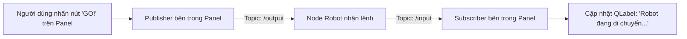

---
tags:
  - ros2
  - rviz2
  - panels
  - qt
  - gui
  - pluginlib
  - cpp
  - intermediate
created: 2026-08-25
aliases:
  - Tự Xây dựng Custom RViz Panel Plugin trong C++
  - Building a Custom RViz Panel
---

# 🎛️ Tự Xây dựng Custom RViz Panel Plugin trong C++ (GUI Panel Plugin)

> [!INFO] **Mục tiêu bài học**
> Học cách tạo một **Bảng điều khiển GUI 2D tùy biến (Custom Panel)** nhúng trực tiếp vào giao diện RViz2 bằng C++ và **Qt**: kế thừa `rviz_common::Panel`, tạo nút bấm (`QPushButton`), nhãn hiển thị (`QLabel`), tích hợp Subscriber và Publisher của ROS 2 để tương tác hai chiều với robot.
> - **Cấp độ:** Intermediate
> - **Thời lượng ước tính:** 20 phút
> - **Bài trước:** [[05 - Building a Custom RViz Display Plugin (C++)|Tự Xây dựng Custom RViz Display Plugin (C++)]]
> - **Mục lục tổng quan:** [[ROS 2 Learning Path]]

---

## 📖 Bối cảnh (Background)

Trong khi **Display Plugin** dùng để vẽ vật thể vào không gian 3D, thì **Panel Plugin** là một cửa sổ giao diện 2D gắn trên thanh công cụ của RViz2 (giống như bảng điều khiển `Views`, `Displays`, `Time`):
- Cho phép người vận hành nhấn nút kích hoạt tác vụ (Bắt đầu quét bản đồ, Khẩn cấp dừng robot E-Stop, Đổi chế độ lái).
- Hiển thị các thông số trạng thái dạng chữ (Phần trăm Pin, Chế độ hoạt động, Tọa độ GPS).



---

## 🛠️ Triển khai mã nguồn C++

### 1. File Header (`include/rviz_panel_tutorial/demo_panel.hpp`)

```cpp
#ifndef RVIZ_PANEL_TUTORIAL__DEMO_PANEL_HPP_
#define RVIZ_PANEL_TUTORIAL__DEMO_PANEL_HPP_

#include <memory>
#include <QLabel>
#include <QPushButton>
#include <rclcpp/rclcpp.hpp>
#include <rviz_common/panel.hpp>
#include <rviz_common/ros_integration/ros_node_abstraction_iface.hpp>
#include <std_msgs/msg/string.hpp>

namespace rviz_panel_tutorial
{
class DemoPanel : public rviz_common::Panel
{
  Q_OBJECT
public:
  explicit DemoPanel(QWidget * parent = nullptr);
  ~DemoPanel() override = default;

  // Khởi tạo các thành phần ROS 2 khi Panel được nhúng vào RViz
  void onInitialize() override;

protected:
  // Con trỏ truy cập Node ROS ngầm định của RViz2
  std::shared_ptr<rviz_common::ros_integration::RosNodeAbstractionIface> node_ptr_;
  rclcpp::Publisher<std_msgs::msg::String>::SharedPtr publisher_;
  rclcpp::Subscription<std_msgs::msg::String>::SharedPtr subscription_;

  void topicCallback(const std_msgs::msg::String & msg);

  QLabel * label_;
  QPushButton * button_;

private Q_SLOTS:
  // Slot Qt kích hoạt khi người dùng bấm nút
  void buttonActivated();
};
} // namespace rviz_panel_tutorial

#endif // RVIZ_PANEL_TUTORIAL__DEMO_PANEL_HPP_
```

---

### 2. File Hiện thực Mã nguồn (`src/demo_panel.cpp`)

```cpp
#include "rviz_panel_tutorial/demo_panel.hpp"
#include <QVBoxLayout>
#include <rviz_common/display_context.hpp>
#include <pluginlib/class_list_macros.hpp>

namespace rviz_panel_tutorial
{

DemoPanel::DemoPanel(QWidget * parent)
: Panel(parent)
{
  // 1. Tạo bố cục giao diện xếp theo chiều dọc (Vertical Box Layout)
  const auto layout = new QVBoxLayout(this);

  // 2. Tạo Label hiển thị văn bản và Nút bấm
  label_ = new QLabel("[Chưa có dữ liệu]");
  button_ = new QPushButton("GỬI LỆNH (GO!)");

  layout->addWidget(label_);
  layout->addWidget(button_);

  // 3. Kết nối sự kiện nhả nút bấm với Slot buttonActivated
  QObject::connect(button_, &QPushButton::released, this, &DemoPanel::buttonActivated);
}

void DemoPanel::onInitialize()
{
  // 4. Lấy rclcpp::Node từ DisplayContext của RViz2
  node_ptr_ = getDisplayContext()->getRosNodeAbstraction().lock();
  rclcpp::Node::SharedPtr node = node_ptr_->get_raw_node();

  // 5. Khởi tạo Publisher xuất bản vào topic '/output'
  publisher_ = node->create_publisher<std_msgs::msg::String>("/output", 10);

  // 6. Khởi tạo Subscriber lắng nghe topic '/input'
  subscription_ = node->create_subscription<std_msgs::msg::String>(
    "/input", 10,
    std::bind(&DemoPanel::topicCallback, this, std::placeholders::_1)
  );
}

void DemoPanel::topicCallback(const std_msgs::msg::String & msg)
{
  // Cập nhật giao diện Qt với dữ liệu nhận được từ ROS 2
  label_->setText(QString::fromStdString("Nhận từ ROS: " + msg.data));
}

void DemoPanel::buttonActivated()
{
  // Phát tin nhắn ra mạng ROS 2 khi bấm nút
  auto message = std_msgs::msg::String();
  message.data = "Nút bấm trên RViz vừa được kích hoạt!";
  publisher_->publish(message);
}

} // namespace rviz_panel_tutorial

// Đăng ký Plugin vào hệ thống pluginlib
PLUGINLIB_EXPORT_CLASS(rviz_panel_tutorial::DemoPanel, rviz_common::Panel)
```

---

### 3. File Đăng ký Plugin (`rviz_common_plugins.xml`)

```xml
<library path="demo_panel">
  <class name="DemoPanel" type="rviz_panel_tutorial::DemoPanel" base_class_type="rviz_common::Panel">
    <description>Bảng điều khiển tương tác ROS 2 tùy biến</description>
  </class>
</library>
```

---

## 🚀 Trải nghiệm Panel trong RViz2

Sau khi build và mở `rviz2`:
1. Trên thanh Menu trên cùng, chọn: **`Panels -> Add New Panel`**.
2. Tìm và chọn **`DemoPanel`** $\rightarrow$ Nhấn **OK**.
3. Một bảng điều khiển nhỏ sẽ xuất hiện ngay trên giao diện RViz!

### Kiểm tra tương tác hai chiều:
- **Gửi dữ liệu lên Panel:**
  ```bash
  ros2 topic pub /input std_msgs/msg/String "{data: 'Xin chào RViz2!'}" --once
  ```
  Nhãn `[Chưa có dữ liệu]` trên panel sẽ lập tức đổi thành *"Nhận từ ROS: Xin chào RViz2!"*.

- **Nhận dữ liệu khi nhấn nút trên Panel:**
  Mở terminal lắng nghe:
  ```bash
  ros2 topic echo /output
  ```
  Khi bạn nhấp chuột vào nút **"GỬI LỆNH (GO!)"** trong RViz, terminal sẽ in ra chuỗi tin nhắn ngay tức khắc!

---

## 📌 Tóm tắt (Summary)
- `rviz_common::Panel` là công cụ tuyệt vời để tích hợp bảng điều khiển chuyên dụng cho người vận hành trực tiếp bên trong cửa sổ RViz2 mà không cần phát triển ứng dụng GUI riêng biệt.

---

## 🔗 Liên kết & Bài tiếp theo
- ⬅️ Bài trước: [[05 - Building a Custom RViz Display Plugin (C++)|Tự Xây dựng Custom RViz Display Plugin (C++)]]
- 🚀 Chúc mừng bạn đã hoàn thành trọn vẹn toàn bộ hệ thống kiến thức **URDF Robot Modeling** & **RViz Visualization**!
