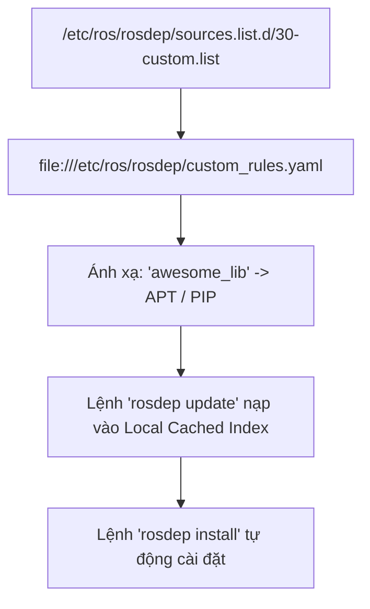

---
tags:
  - ros2
  - rosdep
  - dependencies
  - package-management
  - advanced
created: 2026-08-25
aliases:
  - Bổ sung Custom rosdep Keys cho Thư viện Độc quyền
  - Supplementing custom rosdep keys
---

# 🔑 Bổ sung Custom rosdep Keys cho Thư viện Độc quyền (Custom rosdep Rules)

> [!INFO] **Mục tiêu bài học**
> Học cách mở rộng **`rosdep`** với các nguồn khai báo phụ thuộc tùy biến (**Custom Sources List**): ánh xạ các khóa phụ thuộc nội bộ sang gói **APT** riêng, kho **PPA** bên thứ ba hoặc gói **Python pip**, phục vụ cho các dự án nội bộ của doanh nghiệp mà không cần gửi Pull Request lên `rosdistro` chính thức.
> - **Cấp độ:** Advanced
> - **Thời lượng ước tính:** 15 phút
> - **Mục lục tổng quan:** [[ROS 2 Learning Path]]
> - **Bài trước:** [[01 - Managing Dependencies with rosdep|Quản lý Dependencies với rosdep]]
> - **Bài tiếp theo:** [[02 - Enabling Topic Statistics (C++)|Bật và Đo lường Thống kê Topic bằng C++]]

---

## 📖 Bối cảnh & Lý do Cần Custom Keys

Mặc dù việc đóng góp trực tiếp vào `rosdistro` là chuẩn mực của cộng đồng ROS 2, nhưng trong thực tế doanh nghiệp bạn sẽ gặp các trường hợp:
1. Thư viện là **mã nguồn đóng / độc quyền (Proprietary Library)** của công ty.
2. Thư viện lưu trữ trên máy chủ **PPA riêng** hoặc **Private PyPI Index**.
3. Package ROS 2 do bạn tự build đóng gói `.deb` nội bộ và không muốn công khai ra thế giới.



---

## 🛠️ Triển khai 2 Bước Cấu hình Nguồn Custom

### 1. Tạo File Nguồn Danh sách (`/etc/ros/rosdep/sources.list.d/30-custom.list`)
Tạo file cấu hình với quyền root:

```bash
sudo nano /etc/ros/rosdep/sources.list.d/30-custom.list
```

Thêm dòng khai báo trỏ tới file quy tắc YAML cục bộ (hoặc URL https):
```text
yaml file:///etc/ros/rosdep/custom_rules.yaml
```

---

### 2. Định nghĩa Quy tắc Ánh xạ (`/etc/ros/rosdep/custom_rules.yaml`)

```yaml
awesome_library:
  ubuntu: [awesome_library] # Cài qua apt-get install awesome_library

that_other_library:
  ubuntu:
    pip:
      packages: [another_library] # Cài qua pip install another_library
```

---

## 🚀 Cập nhật và Kiểm tra Tra cứu Khóa

```bash
# 1. Cập nhật cơ sở dữ liệu rosdep
rosdep update

# 2. Kiểm tra tra cứu khóa APT
rosdep resolve awesome_library
# Kết quả:
# apt
# awesome_library

# 3. Kiểm tra tra cứu khóa PIP
rosdep resolve that_other_library
# Kết quả:
# pip
# another_library
```

Bây giờ trong file `package.xml` của bạn, chỉ cần khai báo đơn giản:
```xml
<depend>awesome_library</depend>
<depend>that_other_library</depend>
```

---

## ⚠️ Quy tắc Thứ tự Nạp và Cảnh báo Xung đột

> [!WARNING] **Thứ tự tải theo bảng chữ cái (Alphabetical Order):**
> - Các file trong `/etc/ros/rosdep/sources.list.d/` được nạp theo thứ tự tiền tố số (`10-*.list`, `20-default.list`, `30-custom.list`).
> - Tiền tố `30-custom.list` sẽ **không thể ghi đè** các khóa đã có trong `20-default.list`.
> - Nếu muốn ghi đè khóa mặc định của ROS, bạn phải đặt tên file là `10-override.list`. Tuy nhiên, việc ghi đè có thể dẫn đến **lỗi bất tương thích nhị phân (Binary Incompatibilities)** cực kỳ khó chẩn đoán!

---

## 📌 Tóm tắt (Summary)
- Sử dụng Custom rosdep Sources giúp tự động hóa khâu cài đặt dependencies cho các dự án nội bộ và công nghiệp bảo mật.

---

## 🔗 Liên kết & Bài tiếp theo
- ⬅️ Bài trước: [[01 - Managing Dependencies with rosdep|Quản lý Dependencies với rosdep]]
- ➡️ Bài tiếp theo: [[02 - Enabling Topic Statistics (C++)|Bật và Đo lường Thống kê Topic bằng C++]]
