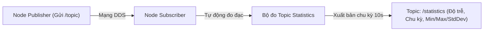

---
tags:
  - ros2
  - topic-statistics
  - metrics
  - latency
  - diagnostics
  - cpp
  - advanced
created: 2026-08-25
aliases:
  - Bật và Đo lường Thống kê Topic bằng C++
  - Enabling topic statistics (C++)
---

# 📊 Bật và Đo lường Thống kê Topic bằng C++ (Topic Statistics)

> [!INFO] **Mục tiêu bài học**
> Học cách kích hoạt tính năng **Topic Statistics** tích hợp sẵn trong `rclcpp`: đo đạc độ trễ truyền tin (**Message Age / Latency**), chu kỳ xuất bản thực tế (**Message Period / Jitter**), độ lệch chuẩn và số lượng mẫu tin nhận được, xuất bản định kỳ lên topic `/statistics`.
> - **Cấp độ:** Advanced
> - **Thời lượng ước tính:** 15 phút
> - **Mục lục tổng quan:** [[ROS 2 Learning Path]]
> - **Bài trước:** [[01 - Supplementing Custom rosdep Keys|Bổ sung Custom rosdep Keys cho Thư viện Độc quyền]]
> - **Bài tiếp theo:** [[03 - DDS Keyed Topics in ROS 2|Cơ chế Phân loại Khóa Topic (DDS Keyed Topics)]]

---

## 📖 Bối cảnh (Background)

Trong các hệ thống robot thời gian thực (Real-time Robotics), việc đảm bảo dữ liệu cảm biến được truyền đi đúng chu kỳ và không bị trễ là yếu tố sống còn. 

Thay vì phải tự viết code đo đếm thời gian bằng tay, ROS 2 cung cấp cơ chế **Topic Statistics** thu thập số liệu thống kê tự động ngay tại lớp Subscription của node nhận.



---

## 🛠️ Triển khai mã nguồn C++ (`member_function_with_topic_statistics.cpp`)

```cpp
#include <chrono>
#include <memory>

#include "rclcpp/rclcpp.hpp"
#include "rclcpp/subscription_options.hpp"
#include "std_msgs/msg/string.hpp"

using namespace std::chrono_literals;

class MinimalSubscriberWithTopicStatistics : public rclcpp::Node
{
public:
  MinimalSubscriberWithTopicStatistics()
  : Node("minimal_subscriber_with_topic_statistics")
  {
    // 1. Tạo đối tượng SubscriptionOptions để bật Statistics
    auto options = rclcpp::SubscriptionOptions();
    options.topic_stats_options.state = rclcpp::TopicStatisticsState::Enable;

    // 2. Cấu hình chu kỳ thu thập & xuất bản báo cáo (mặc định 1 giây, ở đây đặt 10s)
    options.topic_stats_options.publish_period = 10s;

    // 3. (Tùy chọn) Đổi tên topic xuất bản thống kê (mặc định là '/statistics')
    // options.topic_stats_options.publish_topic = "/my_custom_statistics";

    auto callback = [this](const std_msgs::msg::String & msg) {
      RCLCPP_INFO(this->get_logger(), "Đã nhận: '%s'", msg.data.c_str());
    };

    // 4. Khởi tạo Subscription với tùy chọn options
    subscription_ = this->create_subscription<std_msgs::msg::String>(
      "topic", 10, callback, options
    );
  }

private:
  rclcpp::Subscription<std_msgs::msg::String>::SharedPtr subscription_;
};

int main(int argc, char * argv[])
{
  rclcpp::init(argc, argv);
  rclcpp::spin(std::make_shared<MinimalSubscriberWithTopicStatistics>());
  rclcpp::shutdown();
  return 0;
}
```

---

## 🚀 Giám sát Dữ liệu Thống kê từ Dòng lệnh

Khi cả node Publisher và Subscriber đang chạy, kiểm tra topic `/statistics`:

```bash
ros2 topic echo /statistics
```

### Giải mã Bản tin Thống kê Kết quả:

```yaml
---
measurement_source_name: minimal_subscriber_with_topic_statistics
metrics_source: message_period # Đo chu kỳ giữa 2 tin nhắn liên tiếp
unit: ms
window_start:
  sec: 1724601200
  nanosec: 0
window_stop:
  sec: 1724601210
  nanosec: 0
statistics:
- data_type: 1 # Giá trị Trung bình (Average): 500.0 ms
  data: 500.0
- data_type: 2 # Giá trị Nhỏ nhất (Minimum): 499.0 ms
  data: 499.0
- data_type: 3 # Giá trị Lớn nhất (Maximum): 501.2 ms
  data: 501.2
- data_type: 4 # Độ lệch chuẩn (Standard Deviation): 0.45 ms
  data: 0.45
- data_type: 5 # Tổng số mẫu đã nhận (Sample Count): 20 mẫu
  data: 20.0
```

| `data_type` | Ý nghĩa Toán học | Ứng dụng |
| :---: | :--- | :--- |
| **`1`** | **Average** (Trung bình) | Đánh giá tốc độ trung bình của luồng dữ liệu. |
| **`2`** | **Minimum** (Nhỏ nhất) | Khoảng thời gian nhanh nhất. |
| **`3`** | **Maximum** (Lớn nhất) | Phát hiện hiện tượng nghẽn mạng / Spike bất thường. |
| **`4`** | **Standard Deviation** (Độ lệch chuẩn) | Đo mức độ ổn định của xung nhịp (Jitter). |
| **`5`** | **Sample Count** (Số lượng mẫu) | Đếm số lượng gói tin đã nhận trong cửa sổ đo. |

---

## 📌 Tóm tắt (Summary)
- Kích hoạt `TopicStatisticsState::Enable` cho phép phân tích hiệu năng mạng DDS theo thời gian thực mà không làm biến đổi cấu trúc mã nguồn xử lý chính.

---

## 🔗 Liên kết & Bài tiếp theo
- ⬅️ Bài trước: [[01 - Supplementing Custom rosdep Keys|Bổ sung Custom rosdep Keys cho Thư viện Độc quyền]]
- ➡️ Bài tiếp theo: [[03 - DDS Keyed Topics in ROS 2|Cơ chế Phân loại Khóa Topic (DDS Keyed Topics)]]
