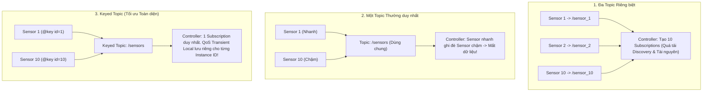

---
tags:
  - ros2
  - dds
  - keyed-topics
  - idl
  - qos
  - transient-local
  - advanced
created: 2026-08-25
aliases:
  - Cơ chế Phân loại Khóa Topic trong ROS 2
  - DDS Keyed Topics in ROS 2
---

# 🔑 Cơ chế Phân loại Khóa Topic trong ROS 2 (DDS Keyed Topics)

> [!INFO] **Mục tiêu bài học**
> Khám phá cơ chế **Keyed Topics** bản địa của tiêu chuẩn DDS trong ROS 2: sử dụng chú thích **`@key`** trong file **IDL (Interface Definition Language)** để gộp hàng chục luồng cảm biến độc lập vào một topic duy nhất, tối ưu tài nguyên mạng và đảm bảo node đến muộn (**Late-Joining Node**) nhận đủ trạng thái mới nhất của từng cảm biến qua **Transient Local QoS**.
> - **Cấp độ:** Advanced
> - **Thời lượng ước tính:** 20 phút
> - **Mục lục tổng quan:** [[ROS 2 Learning Path]]
> - **Bài trước:** [[02 - Enabling Topic Statistics (C++)|Bật và Đo lường Thống kê Topic bằng C++]]
> - **Bài tiếp theo:** [[04 - Topic Keys Subscription Filtering (Content Filtered Topics)|Lọc Nội dung Topic kết hợp Keyed Topics (Content Filtered Topics)]]

---

## 📖 So sánh 3 Chiến lược Quản lý Đa Cảm biến

Giả sử bạn có 10 cảm biến truyền dữ liệu về bộ điều khiển trung tâm (với tần số phát khác nhau từ 1 giây đến 10 giây/lần):



| Tiêu chí so sánh | 1. Đa Topic riêng lẻ | 2. Một Topic thường | 3. Keyed Topic (DDS @key) |
| :--- | :--- | :--- | :--- |
| **Số lượng Entities (Pub/Sub)** | $N$ Publishers + $N$ Subscribers | 1 Pub + 1 Sub | **1 Pub + 1 Sub duy nhất** |
| **Chi phí Discovery trên mạng** | Rất cao (Oversized graph) | Rất thấp | **Tối ưu nhất** |
| **Node đến muộn (Late Joiner)** | Nhận đủ qua 10 sub | Bị đè mất tin của sensor chậm | **Nhận đủ chính xác 100% từng ID** |

---

## 🛠️ Tạo Thông điệp Keyed Message với File IDL

Hiện tại trong ROS 2, chú thích `@key` chỉ được hỗ trợ trực tiếp trong định dạng **`.idl`** (chưa hỗ trợ trong `.msg`).

### 1. Khai báo File IDL (`msg/KeyedSensorDataMsg.idl`)

```idl
/* KeyedSensorDataMsg.idl */
module demo_keys_cpp {
  module msg {
    struct KeyedSensorDataMsg {
      @key int16 sensor_id; // Đánh dấu sensor_id là khóa định danh (Key)
      string data;
    };
  };
};
```

---

## ⚙️ Thiết lập QoS và Cơ chế Instance-based Durability

Khi sử dụng Keyed Topic kết hợp với cấu hình QoS:
- **`History: KEEP_LAST (1)`**
- **`Reliability: RELIABLE`**
- **`Durability: TRANSIENT_LOCAL`**

Hệ thống DDS ngầm định sẽ **duy trì một bộ đệm lịch sử (Cache History) riêng biệt cho mỗi giá trị `sensor_id` khác nhau**. Khi Controller khởi động sau, DDS sẽ tự động gửi 10 bản tin mới nhất của 10 sensor tương ứng ngay lập tức!

---

## ⚠️ Khả năng Tương thích của RMW Implementations

| RMW Implementation | Hỗ trợ DDS Keyed Topics? |
| :--- | :---: |
| **`rmw_fastrtps_cpp`** (Fast DDS) | ✅ Có hỗ trợ đầy đủ |
| **`rmw_connextdds`** (Cyclone Connext) | ✅ Có hỗ trợ đầy đủ |
| **`rmw_cyclonedds_cpp`** (Cyclone DDS) | ❌ Không hỗ trợ (sẽ xem như topic thường) |

---

## 📌 Tóm tắt (Summary)
- Keyed Topics là giải pháp chuẩn công nghiệp để gom nhóm các đối tượng cùng loại mà vẫn giữ trọn vẹn trạng thái độc lập của từng đối tượng.

---

## 🔗 Liên kết & Bài tiếp theo
- ⬅️ Bài trước: [[02 - Enabling Topic Statistics (C++)|Bật và Đo lường Thống kê Topic bằng C++]]
- ➡️ Bài tiếp theo: [[04 - Topic Keys Subscription Filtering (Content Filtered Topics)|Lọc Nội dung Topic kết hợp Keyed Topics (Content Filtered Topics)]]
