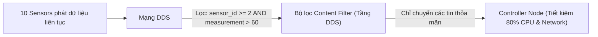

---
tags:
  - ros2
  - dds
  - content-filtered-topics
  - cft
  - keyed-topics
  - filtering
  - advanced
created: 2026-08-25
aliases:
  - Lọc Nội dung Topic kết hợp Keyed Topics
  - Topic Keys Subscription Filtering (Content Filtered Topics)
---

# 🔍 Lọc Nội dung Topic kết hợp Keyed Topics (Content Filtered Topics)

> [!INFO] **Mục tiêu bài học**
> Làm chủ **Content Filtered Topics (CFT)** kết hợp với **Keyed Topics**: lọc dữ liệu thông minh ngay tại tầng mạng DDS bằng biểu thức điều kiện dạng SQL (**`filter_expression`**), giúp Subscription chỉ nhận các gói tin thỏa mãn tiêu chí (ví dụ: chỉ nhận cảm biến ID từ 2 đến 4 có giá trị đo vượt ngưỡng cảnh báo).
> - **Cấp độ:** Advanced
> - **Thời lượng ước tính:** 20 phút
> - **Mục lục tổng quan:** [[ROS 2 Learning Path]]
> - **Bài trước:** [[03 - DDS Keyed Topics in ROS 2|Cơ chế Phân loại Khóa Topic (DDS Keyed Topics)]]
> - **Bài tiếp theo:** [[05 - Fast DDS Discovery Server Architecture|Kiến trúc Fast DDS Discovery Server]]

---

## 📖 Sức mạnh của Content Filtered Topic (CFT)

Trong cách lập trình truyền thống, Subscriber phải nhận **tất cả mọi gói tin** qua mạng rồi mới dùng lệnh `if (...)` để lọc bỏ. Điều này làm lãng phí băng thông mạng và tiêu tốn CPU.

Với **Content Filtered Topic**:
- Biểu thức điều kiện được truyền xuống tầng middleware (DDS).
- Các gói tin không thỏa mãn điều kiện sẽ bị **loại bỏ ngay từ phía Publisher hoặc tại tầng Driver mạng**, không bao giờ làm thức giấc thread của Subscriber!



---

## 🛠️ Triển khai mã nguồn C++ (`filtered_keyed_controller.cpp`)

```cpp
#include <memory>
#include <string>
#include <vector>

#include "demo_keys_filtering_cpp/msg/keyed_sensor_data_msg.hpp"
#include "rclcpp/rclcpp.hpp"

class FilteredKeyedController : public rclcpp::Node
{
public:
  FilteredKeyedController()
  : Node("filtered_keyed_controller")
  {
    auto callback = [this](const demo_keys_filtering_cpp::msg::KeyedSensorDataMsg & msg) {
      RCLCPP_INFO(
        this->get_logger(),
        "ĐÃ LỌC: Nhận cảnh báo từ Sensor ID [%d] với giá trị = %.2f: '%s'",
        msg.sensor_id, msg.measurement, msg.data.c_str()
      );
    };

    // 1. Cấu hình SubscriptionOptions với Content Filter
    rclcpp::SubscriptionOptions sub_options;
    
    // Biểu thức lọc SQL: Chỉ nhận sensor_id từ 2 đến 4 VÀ measurement lớn hơn %0
    sub_options.content_filter_options.filter_expression =
      "sensor_id >= 2 AND sensor_id <= 4 AND measurement > %0";

    // Tham số %0 được gán động tại runtime (ví dụ ngưỡng 60.0)
    sub_options.content_filter_options.expression_parameters = {"60.0"};

    // 2. Khởi tạo Subscription kết hợp QoS Transient Local và Content Filter
    sub_ = this->create_subscription<demo_keys_filtering_cpp::msg::KeyedSensorDataMsg>(
      "/robot/sensors",
      rclcpp::QoS(rclcpp::KeepLast(1)).reliable().transient_local(),
      callback,
      sub_options
    );
  }

private:
  rclcpp::Subscription<demo_keys_filtering_cpp::msg::KeyedSensorDataMsg>::SharedPtr sub_;
};

int main(int argc, char ** argv)
{
  rclcpp::init(argc, argv);
  rclcpp::spin(std::make_shared<FilteredKeyedController>());
  rclcpp::shutdown();
  return 0;
}
```

---

## 📌 Tóm tắt (Summary)
- Sự kết hợp giữa **`@key`** và **`content_filter_options`** mang lại giải pháp quản trị luồng dữ liệu phân tán tối ưu nhất cho các hệ thống Robotics quy mô lớn (hàng trăm cảm biến IoT, xe tự hành AGV trong nhà máy).

---

## 🔗 Liên kết & Bài tiếp theo
- ⬅️ Bài trước: [[03 - DDS Keyed Topics in ROS 2|Cơ chế Phân loại Khóa Topic (DDS Keyed Topics)]]
- ➡️ Bài tiếp theo: [[05 - Fast DDS Discovery Server Architecture|Kiến trúc Fast DDS Discovery Server]]
