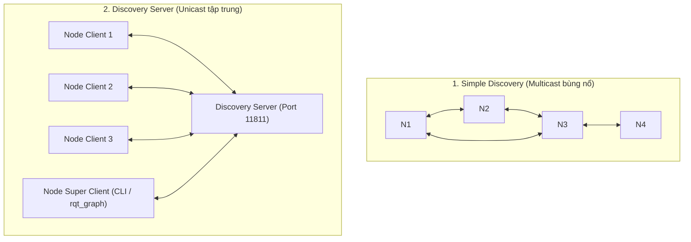

---
tags:
  - ros2
  - fastdds
  - discovery-server
  - networking
  - super-client
  - scalability
  - advanced
created: 2026-08-25
aliases:
  - Kiến trúc Fast DDS Discovery Server
  - Fast DDS Discovery Server as discovery protocol
---

# 🌐 Kiến trúc Fast DDS Discovery Server (Centralized Discovery)

> [!INFO] **Mục tiêu bài học**
> Chuyển đổi giao thức tìm kiếm nút mạng từ cơ chế phân tán Multicast (**Simple Discovery**) sang mô hình Máy chủ - Máy khách tập trung (**Fast DDS Discovery Server**): giải quyết triệt để vấn đề nghẽn mạng trên mạng không dây WiFi, cấu hình máy chủ dự phòng (**Redundancy & Backup**), phân vùng mạng (**Partitions**) và thiết lập **Super Client** cho các công cụ giám sát ROS 2 CLI.
> - **Cấp độ:** Advanced
> - **Thời lượng ước tính:** 20 phút
> - **Mục lục tổng quan:** [[ROS 2 Learning Path]]
> - **Bài trước:** [[04 - Topic Keys Subscription Filtering (Content Filtered Topics)|Lọc Nội dung Topic kết hợp Keyed Topics (Content Filtered Topics)]]
> - **Bài tiếp theo:** [[06 - Unlocking Fast DDS XML Profiles and Features|Khai phá Sức mạnh Cấu hình XML trong Fast DDS]]

---

## 📖 Tại sao cần Discovery Server?

Mặc định, DDS sử dụng giao thức **Simple Discovery Protocol (SDP)**:
- Mỗi khi có 1 node mới xuất hiện, nó phát các gói tin **UDP Multicast** đến mọi thiết bị trong mạng con để tìm các node khác.
- **Nhược điểm:** Số lượng gói tin bắt tay tăng vọt theo hàm bậc hai ($O(N^2)$), gây nghẽn mạng nghiêm trọng trong hệ thống lớn (hàng chục robot) và **hoạt động rất kém ổn định trên sóng WiFi**.

**Fast DDS Discovery Server** chuyển đổi sang kiến trúc Client-Server:
- Các node chỉ gửi gói tin Unicast trực tiếp đến địa chỉ IP/Port của Discovery Server.
- Server chịu trách nhiệm môi giới thông tin kết nối giữa các node quan tâm đến cùng topic.



---

## 🚀 Hướng dẫn Cấu hình và Khởi chạy Nhanh

### 1. Khởi động Discovery Server
Dùng công cụ `fastdds` CLI (được cài sẵn cùng Fast DDS):

```bash
# Chạy Discovery Server ID 0, Port 11811
fastdds discovery --server-id 0
```

---

### 2. Khởi chạy các Node ROS 2 kết nối tới Server
Đặt biến môi trường `ROS_DISCOVERY_SERVER`:

```bash
# Terminal 1: Chạy Listener
export ROS_DISCOVERY_SERVER=127.0.0.1:11811
ros2 run demo_nodes_cpp listener

# Terminal 2: Chạy Talker
export ROS_DISCOVERY_SERVER=127.0.0.1:11811
ros2 run demo_nodes_cpp talker
```

---

## 🛡️ Các Tính năng Nâng cao (Advanced Features)

### 1. Máy chủ Dự phòng (Server Redundancy)
Khởi chạy 2 server song song để tránh điểm lỗi duy nhất (Single Point of Failure):

```bash
# Server 0
fastdds discovery --server-id 0 --udp-port 11811
# Server 1
fastdds discovery --server-id 1 --udp-port 11888

# Các Node kết nối đồng thời cả 2 server:
export ROS_DISCOVERY_SERVER="127.0.0.1:11811;127.0.0.1:11888"
```

---

### 2. Máy chủ Tự khôi phục Trạng thái (`--backup`)
```bash
fastdds discovery --server-id 0 --backup
```
Server sẽ tự động ghi nhật ký SQLite/JSON. Nếu tiến trình bị crash, khi khởi động lại nó sẽ phục hồi ngay lập tức toàn bộ sơ đồ mạng mà không cần các node phải discovery lại từ đầu.

---

### 3. Cấu hình "Super Client" cho ROS 2 CLI & RQt

Discovery Server v2 chỉ chuyển giao thông tin topic cho các node có nhu cầu. Do đó, các công cụ giám sát như `ros2 topic list`, `ros2 topic echo`, `rqt_graph` sẽ không nhìn thấy gì nếu không được cấp quyền **Super Client**.

Tạo file `super_client.xml`:
```xml
<?xml version="1.0" encoding="UTF-8" ?>
<dds xmlns="http://www.eprosima.com/XMLSchemas/fastRTPS_Profiles">
    <profiles>
        <participant profile_name="super_client" is_default_profile="true">
            <rtps>
                <builtin>
                    <discovery_config>
                        <discoveryProtocol>SUPER_CLIENT</discoveryProtocol>
                        <discoveryServersList>
                            <RemoteServer prefix="44.53.00.5f.45.50.52.4f.53.49.4d.41">
                                <metatrafficUnicastLocatorList>
                                    <locator>
                                        <udpv4>
                                            <address>127.0.0.1</address>
                                            <port>11811</port>
                                        </udpv4>
                                    </locator>
                                </metatrafficUnicastLocatorList>
                            </RemoteServer>
                        </discoveryServersList>
                    </discovery_config>
                </builtin>
            </rtps>
        </participant>
    </profiles>
</dds>
```

Khởi động lại ROS 2 Daemon với cấu hình Super Client:
```bash
export FASTDDS_DEFAULT_PROFILES_FILE=super_client.xml
ros2 daemon stop
ros2 daemon start

# Bây giờ các lệnh CLI sẽ thấy toàn bộ mạng!
ros2 topic list
ros2 run rqt_graph rqt_graph
```

---

## 📌 Tóm tắt (Summary)
- Discovery Server là giải pháp tiêu chuẩn để mở rộng quy mô ROS 2 trên mạng WiFi và hệ thống đa robot công nghiệp.

---

## 🔗 Liên kết & Bài tiếp theo
- ⬅️ Bài trước: [[04 - Topic Keys Subscription Filtering (Content Filtered Topics)|Lọc Nội dung Topic kết hợp Keyed Topics (Content Filtered Topics)]]
- ➡️ Bài tiếp theo: [[06 - Unlocking Fast DDS XML Profiles and Features|Khai phá Sức mạnh Cấu hình XML trong Fast DDS]]
