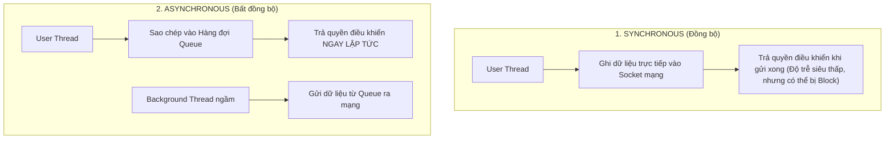

---
tags:
  - ros2
  - fastdds
  - xml-profiles
  - sync-async
  - partitions
  - rmw
  - advanced
created: 2026-08-25
aliases:
  - Khai phá Sức mạnh Cấu hình XML trong Fast DDS
  - Unlocking the potential of Fast DDS middleware
---

# ⚙️ Khai phá Sức mạnh Cấu hình XML trong Fast DDS (XML QoS Profiles)

> [!INFO] **Mục tiêu bài học**
> Mở khóa toàn bộ các tính năng cao cấp của **Fast DDS** thông qua tệp cấu hình **XML Profiles**: kết hợp đồng thời Publisher đồng bộ (**SYNCHRONOUS**) và bất đồng bộ (**ASYNCHRONOUS**) trong cùng một node, thiết lập phân vùng dữ liệu (**Partitions**), giới hạn số lượng Subscriber kết nối (**Matched Allocation**) và tối ưu hóa Service/Client.
> - **Cấp độ:** Advanced
> - **Thời lượng ước tính:** 20 phút
> - **Mục lục tổng quan:** [[ROS 2 Learning Path]]
> - **Bài trước:** [[05 - Fast DDS Discovery Server Architecture|Kiến trúc Fast DDS Discovery Server]]
> - **Bài tiếp theo:** [[07 - Configuring Discovery Range and Static Peers|Cấu hình Phạm vi Discovery và Danh sách Static Peers]]

---

## 📖 So sánh Xuất bản Đồng bộ vs Bất đồng bộ



---

## 🛠️ Cấu hình Tệp XML Profile (`SyncAsync.xml`)

```xml
<?xml version="1.0" encoding="UTF-8" ?>
<profiles xmlns="http://www.eprosima.com/XMLSchemas/fastRTPS_Profiles">

    <!-- 1. Profile mặc định cho Publisher & Subscriber -->
    <publisher profile_name="default_publisher" is_default_profile="true">
        <historyMemoryPolicy>DYNAMIC</historyMemoryPolicy>
    </publisher>

    <subscriber profile_name="default_subscriber" is_default_profile="true">
        <historyMemoryPolicy>DYNAMIC</historyMemoryPolicy>
    </subscriber>

    <!-- 2. Profile gán riêng cho topic /sync_topic: Chế độ ĐỒNG BỘ -->
    <publisher profile_name="/sync_topic">
        <historyMemoryPolicy>DYNAMIC</historyMemoryPolicy>
        <qos>
            <publishMode>
                <kind>SYNCHRONOUS</kind>
            </publishMode>
            <!-- Phân vùng mạng (Partition): Chỉ ai cùng part1 mới nhận được -->
            <partition>
                <names>
                    <name>part1</name>
                </names>
            </partition>
        </qos>
    </publisher>

    <!-- 3. Profile gán cho topic /async_topic: BẤT ĐỒNG BỘ + GIỚI HẠN 1 SUB -->
    <publisher profile_name="/async_topic">
        <historyMemoryPolicy>DYNAMIC</historyMemoryPolicy>
        <qos>
            <publishMode>
                <kind>ASYNCHRONOUS</kind>
            </publishMode>
        </qos>
        <!-- Giới hạn tối đa chỉ 1 Subscriber được kết nối -->
        <matchedSubscribersAllocation>
            <initial>0</initial>
            <maximum>1</maximum>
            <increment>1</increment>
        </matchedSubscribersAllocation>
    </publisher>

    <!-- 4. Profile áp dụng chung cho toàn bộ Services và Clients -->
    <publisher profile_name="service">
        <historyMemoryPolicy>DYNAMIC</historyMemoryPolicy>
        <qos>
            <publishMode><kind>SYNCHRONOUS</kind></publishMode>
        </qos>
    </publisher>

    <publisher profile_name="client">
        <historyMemoryPolicy>DYNAMIC</historyMemoryPolicy>
        <qos>
            <publishMode><kind>ASYNCHRONOUS</kind></publishMode>
        </qos>
    </publisher>

</profiles>
```

---

## 🚀 Kích hoạt Cấu hình XML lúc Chạy Node

Để ROS 2 đọc các tham số chuyên sâu từ XML thay vì giá trị mặc định của RMW, bạn cần xuất **3 biến môi trường**:

```bash
export RMW_IMPLEMENTATION=rmw_fastrtps_cpp
export RMW_FASTRTPS_USE_QOS_FROM_XML=1
export FASTDDS_DEFAULT_PROFILES_FILE=/path/to/SyncAsync.xml

# Khởi chạy node
ros2 run sync_async_node_example_cpp SyncAsyncWriter
```

> [!NOTE] **Lưu ý về `historyMemoryPolicy`:**
> Khi bật `RMW_FASTRTPS_USE_QOS_FROM_XML=1`, bạn bắt buộc phải chỉ định `<historyMemoryPolicy>DYNAMIC</historyMemoryPolicy>` trong các profile để hỗ trợ các kiểu dữ liệu biến thiên kích thước của ROS 2.

---

## 📌 Tóm tắt (Summary)
- Sử dụng Fast DDS XML Profiles cho phép can thiệp sâu vào kiến trúc tầng truyền tải dữ liệu mà không cần sửa đổi bất kỳ dòng mã nguồn C++/Python nào.

---

## 🔗 Liên kết & Bài tiếp theo
- ⬅️ Bài trước: [[05 - Fast DDS Discovery Server Architecture|Kiến trúc Fast DDS Discovery Server]]
- ➡️ Bài tiếp theo: [[07 - Configuring Discovery Range and Static Peers|Cấu hình Phạm vi Discovery và Danh sách Static Peers]]
