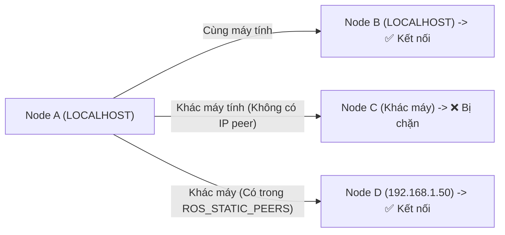

---
tags:
  - ros2
  - networking
  - discovery-range
  - static-peers
  - isolation
  - advanced
created: 2026-08-25
aliases:
  - Cấu hình Phạm vi Discovery và Danh sách Static Peers
  - Improved Dynamic Discovery
---

# 🛡️ Cấu hình Phạm vi Discovery và Danh sách Static Peers (Discovery Isolation)

> [!INFO] **Mục tiêu bài học**
> Làm chủ 2 biến môi trường cốt lõi kiểm soát phạm vi giao tiếp mạng trong ROS 2: **`ROS_AUTOMATIC_DISCOVERY_RANGE`** (cô lập giao tiếp nội bộ máy tính hoặc mạng con) và **`ROS_STATIC_PEERS`** (chỉ định đích danh địa chỉ IP của các robot từ xa cần kết nối mà không cần quét toàn mạng).
> - **Cấp độ:** Advanced
> - **Thời lượng ước tính:** 15 phút
> - **Mục lục tổng quan:** [[ROS 2 Learning Path]]
> - **Bài trước:** [[06 - Unlocking Fast DDS XML Profiles and Features|Khai phá Sức mạnh Cấu hình XML trong Fast DDS]]
> - **Bài tiếp theo:** [[08 - Implementing Custom Real-Time Memory Allocator (C++)|Tự Triển khai Memory Allocator Thời gian Thực (C++)]]

---

## 📖 2 Biến Môi trường Kiểm soát Mạng Toàn cầu

### 1. `ROS_AUTOMATIC_DISCOVERY_RANGE`
Quy định khoảng cách tìm kiếm node tự động:

| Giá trị | Hành vi | Trường hợp sử dụng |
| :--- | :--- | :--- |
| **`SUBNET`** *(Mặc định)* | Quét tìm mọi node trên cùng mạng cục bộ qua Multicast | Môi trường thử nghiệm thông thường. |
| **`LOCALHOST`** | **Chỉ kết nối với các node trên cùng một máy tính** | Chạy thử nghiệm mà không bị ảnh hưởng bởi đồng nghiệp khác trong cùng văn phòng. |
| **`OFF`** | Tắt hoàn toàn việc tìm kiếm tự động | Dùng khi kết hợp với danh sách IP tĩnh cố định. |
| **`SYSTEM_DEFAULT`** | Giữ nguyên thiết lập mặc định của RMW | Tùy biến sâu. |

---

### 2. `ROS_STATIC_PEERS`
Chỉ định danh sách địa chỉ IP hoặc tên miền máy chủ ngăn cách bởi dấu chấm phẩy (`;`) mà node được phép kết nối đến:

```bash
# Chỉ giao tiếp nội bộ máy + kết nối đến 2 robot tại địa chỉ IP cụ thể
export ROS_AUTOMATIC_DISCOVERY_RANGE=LOCALHOST
export ROS_STATIC_PEERS="192.168.1.50;192.168.1.51"
```

---

## 📊 Bảng Ma trận Giao tiếp giữa Node A và Node B (Cùng máy và Khác máy)



---

## 💡 Thiết lập Cố định cho Môi trường Phát triển

Để tránh việc vô tình làm nhiễu robot thật khi đang test mô phỏng trên laptop cá nhân, hãy thêm dòng sau vào `~/.bashrc`:

```bash
echo "export ROS_AUTOMATIC_DISCOVERY_RANGE=LOCALHOST" >> ~/.bashrc
```

---

## 📌 Tóm tắt (Summary)
- Sử dụng `ROS_AUTOMATIC_DISCOVERY_RANGE=LOCALHOST` là giải pháp sạch sẽ và an toàn nhất để cô lập môi trường làm việc khi nhiều kỹ sư cùng chia sẻ một mạng WiFi văn phòng.

---

## 🔗 Liên kết & Bài tiếp theo
- ⬅️ Bài trước: [[06 - Unlocking Fast DDS XML Profiles and Features|Khai phá Sức mạnh Cấu hình XML trong Fast DDS]]
- ➡️ Bài tiếp theo: [[08 - Implementing Custom Real-Time Memory Allocator (C++)|Tự Triển khai Memory Allocator Thời gian Thực (C++)]]
