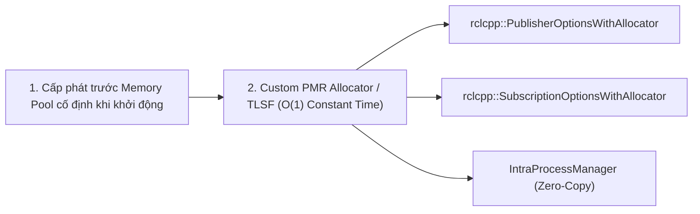

---
tags:
  - ros2
  - real-time
  - memory-management
  - allocator
  - std-pmr
  - tlsf
  - cpp
  - advanced
created: 2026-08-25
aliases:
  - Tự Triển khai Memory Allocator Thời gian Thực trong C++
  - Implementing a custom memory allocator
---

# ⚡ Tự Triển khai Memory Allocator Thời gian Thực trong C++ (Real-Time Custom Allocator)

> [!INFO] **Mục tiêu bài học**
> Học kỹ thuật lập trình an toàn thời gian thực (**Real-Time Safe Programming**) trong ROS 2: thay thế cơ chế cấp phát bộ nhớ heap mặc định (`new`/`malloc` phi tiền định) bằng bộ cấp phát tĩnh **C++17 `std::pmr::memory_resource`** và bộ cấp phát thời gian không đổi **TLSF (Two-Level Segregated Fit)**, triệt tiêu độ trễ phân mảnh bộ nhớ trong các vòng lặp điều khiển tần số cao (1 kHz).
> - **Cấp độ:** Advanced
> - **Thời lượng ước tính:** 20 phút
> - **Mục lục tổng quan:** [[ROS 2 Learning Path]]
> - **Bài trước:** [[07 - Configuring Discovery Range and Static Peers|Cấu hình Phạm vi Discovery và Danh sách Static Peers]]
> - **Bài tiếp theo:** [[09 - Code Quality Assurance with Ament Lint CLI|Đảm bảo Chất lượng Mã nguồn với Ament Lint CLI]]

---

## 📖 Mối nguy của `new` trong Hệ thống Real-Time

Trong các vòng lặp điều khiển robot chính xác (Hard Real-Time):
- Lệnh gọi `new` / `malloc` của hệ điều hành là **phi tiền định (Non-deterministic)**: thời gian thực thi có thể mất từ vài micro-giây đến hàng mili-giây nếu xảy ra phân mảnh bộ nhớ (*Page Fault*).
- Điều này sẽ làm vi phạm thời hạn trễ (*Deadline Miss*), gây mất ổn định điều khiển động cơ robot.

**Giải pháp:** Cấp phát trước một vùng đệm tĩnh (**Pre-allocated Memory Pool**) và sử dụng Custom Allocator cho toàn bộ Publisher, Subscriber và Executor của ROS 2.



---

## 🛠️ Triển khai mã nguồn C++ với `std::pmr` (C++17)

### 1. Định nghĩa Lớp `CustomMemoryResource`

```cpp
#include <memory_resource>

class CustomMemoryResource : public std::pmr::memory_resource
{
private:
  // Cấp phát từ pool tĩnh
  void * do_allocate(std::size_t bytes, std::size_t alignment) override
  {
    // Cấp phát bộ nhớ với thời gian xác định O(1)
    return ::operator new(bytes); // Hoặc lấy từ Static Buffer
  }

  void do_deallocate(void * p, std::size_t bytes, std::size_t alignment) override
  {
    ::operator delete(p);
  }

  bool do_is_equal(const std::pmr::memory_resource & other) const noexcept override
  {
    return this == &other;
  }
};
```

---

### 2. Gán Allocator vào Publisher và Subscriber

```cpp
#include "rclcpp/rclcpp.hpp"
#include "std_msgs/msg/u_int32.hpp"

using Alloc = std::pmr::polymorphic_allocator<void>;
using MessageAllocTraits = rclcpp::allocator::AllocRebind<std_msgs::msg::UInt32, Alloc>;
using MessageAlloc = MessageAllocTraits::allocator_type;
using MessageDeleter = rclcpp::allocator::Deleter<MessageAlloc, std_msgs::msg::UInt32>;
using MessageUniquePtr = std::unique_ptr<std_msgs::msg::UInt32, MessageDeleter>;

int main(int argc, char * argv[])
{
  rclcpp::init(argc, argv);
  auto node = rclcpp::Node::make_shared("allocator_example");

  CustomMemoryResource mem_resource;
  auto alloc = std::make_shared<Alloc>(&mem_resource);

  // 1. Cấu hình Publisher với Custom Allocator
  rclcpp::PublisherOptionsWithAllocator<Alloc> publisher_options;
  publisher_options.allocator = alloc;
  auto publisher = node->create_publisher<std_msgs::msg::UInt32>(
    "allocator_topic", 10, publisher_options
  );

  // 2. Cấu hình Subscriber với Custom Allocator
  rclcpp::SubscriptionOptionsWithAllocator<Alloc> subscription_options;
  subscription_options.allocator = alloc;
  auto msg_mem_strat = std::make_shared<
    rclcpp::message_memory_strategy::MessageMemoryStrategy<std_msgs::msg::UInt32, Alloc>
  >(alloc);

  auto subscriber = node->create_subscription<std_msgs::msg::UInt32>(
    "allocator_topic", 10,
    [](const std_msgs::msg::UInt32::SharedPtr msg) { (void)msg; },
    subscription_options, msg_mem_strat
  );

  // 3. Khởi tạo Deleter và xuất bản dữ liệu an toàn
  MessageDeleter message_deleter;
  MessageAlloc message_alloc = *alloc;
  rclcpp::allocator::set_allocator_for_deleter(&message_deleter, &message_alloc);

  // Xuất bản bản tin sử dụng bộ nhớ tĩnh
  auto ptr = MessageAllocTraits::allocate(message_alloc, 1);
  MessageAllocTraits::construct(message_alloc, ptr);
  MessageUniquePtr msg(ptr, message_deleter);
  msg->data = 42;

  publisher->publish(std::move(msg));

  rclcpp::shutdown();
  return 0;
}
```

---

## ⚡ Bộ Cấp phát TLSF (Two-Level Segregated Fit)

Trong thực tế, Open Robotics hỗ trợ sẵn gói **`tlsf_cpp`** (Two-Level Segregated Fit Allocator):
- Thuật toán cấp phát và giải phóng bộ nhớ với độ phức tạp thời gian **chắc chắn là $O(1)$**.
- Không bao giờ bị phân mảnh bộ nhớ (Memory Fragmentation).
- Được sử dụng rộng rãi trong các dự án xe tự hành đạt chuẩn an toàn chức năng ISO 26262.

---

## 📌 Tóm tắt (Summary)
- Custom Allocator kết hợp cùng `tlsf_cpp` biến ROS 2 thành một hệ điều hành robot hoàn chỉnh đạt chuẩn thời gian thực khắt khe.

---

## 🔗 Liên kết & Bài tiếp theo
- ⬅️ Bài trước: [[07 - Configuring Discovery Range and Static Peers|Cấu hình Phạm vi Discovery và Danh sách Static Peers]]
- ➡️ Bài tiếp theo: [[09 - Code Quality Assurance with Ament Lint CLI|Đảm bảo Chất lượng Mã nguồn với Ament Lint CLI]]
