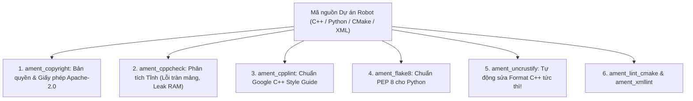

---
tags:
  - ros2
  - linting
  - code-quality
  - ament
  - static-analysis
  - formatting
  - advanced
created: 2026-08-25
aliases:
  - Đảm bảo Chất lượng Mã nguồn với Ament Lint CLI
  - Ament Lint CLI Utilities
---

# 🧹 Đảm bảo Chất lượng Mã nguồn với Ament Lint CLI (Code Quality & Linters)

> [!INFO] **Mục tiêu bài học**
> Làm chủ bộ công cụ kiểm tra tĩnh (**Static Analysis**) và định dạng mã nguồn tự động của hệ sinh thái ROS 2: **`ament_copyright`**, **`ament_cppcheck`**, **`ament_cpplint`**, **`ament_flake8`**, và tự động sửa định dạng C++ với **`ament_uncrustify --reformat`**.
> - **Cấp độ:** Advanced
> - **Thời lượng ước tính:** 15 phút
> - **Mục lục tổng quan:** [[ROS 2 Learning Path]]
> - **Bài trước:** [[08 - Implementing Custom Real-Time Memory Allocator (C++)|Tự Triển khai Memory Allocator Thời gian Thực (C++)]]
> - **Bài tiếp theo:** [[10 - Tracing and Performance Analysis with ros2_tracing|Giám sát và Phân tích Hiệu năng với ros2_tracing]]

---

## 📖 Tổng quan Bộ Công cụ `ament_lint`

Để đảm bảo các Pull Request đạt chuẩn đóng góp của Open Robotics và các dự án công nghiệp:



---

## 🛠️ Hướng dẫn Sử dụng 5 Công cụ Linter Chủ lực

### 1. `ament_copyright`: Kiểm tra và Tự động Thêm Bản quyền
Quét xem các file có thiếu thông tin License hay Copyright không:

```bash
# Quét kiểm tra
ament_copyright ./src ./include

# TỰ ĐỘNG THÊM BẢN QUYỀN VÀO TẤT CẢ FILE THIẾU:
ament_copyright --add-missing "Cong Ty Cua Ban" apache2
```

---

### 2. `ament_cppcheck`: Phân tích Tĩnh Tìm Lỗi Tiềm Ẩn (Bug Hunter)
Phát hiện các lỗi nguy hiểm như truy cập mảng ngoài giới hạn (*Array Index Out of Bounds*), rò rỉ con trỏ:

```bash
ament_cppcheck ./src
# Ví dụ kết quả phát hiện lỗi:
# [example.cpp:4]: (error: arrayIndexOutOfBounds) Array 'a[10]' accessed at index 10, which is out of bounds.
```

---

### 3. `ament_flake8`: Kiểm tra Phong cách Code Python (PEP 8)
Phát hiện biến không dùng, dòng code quá dài (>99 ký tự), thiếu dấu cách:

```bash
ament_flake8 my_package/
```

---

### 4. `ament_uncrustify`: Tự Động Định Dạng Code C++ (Auto-Formatter)

> [!TIP] **Tiết kiệm hàng giờ sửa format thủ công!**
> Thêm cờ **`--reformat`** để công cụ tự động căn lề thụt dòng chuẩn xác cho toàn bộ file C++:

```bash
# Quét kiểm tra độ lệch chuẩn:
ament_uncrustify src/

# TỰ ĐỘNG FORMAT LẠI TOÀN BỘ FILE TRỰC TIẾP:
ament_uncrustify --reformat src/
```

---

### 5. Các Công cụ Hỗ trợ Khác
- **`ament_lint_cmake`**: Kiểm tra định dạng file `CMakeLists.txt`.
- **`ament_xmllint`**: Kiểm tra cú pháp XML trong `package.xml` và các file `*.launch.xml`.
- **`ament_pep257`**: Kiểm tra chuẩn viết docstring của Python.

---

## 📌 Tóm tắt (Summary)
- Chạy `ament_lint` trước khi tạo Pull Request là thói quen của mọi kỹ sư ROS 2 chuyên nghiệp.

---

## 🔗 Liên kết & Bài tiếp theo
- ⬅️ Bài trước: [[08 - Implementing Custom Real-Time Memory Allocator (C++)|Tự Triển khai Memory Allocator Thời gian Thực (C++)]]
- ➡️ Bài tiếp theo: [[10 - Tracing and Performance Analysis with ros2_tracing|Giám sát và Phân tích Hiệu năng với ros2_tracing]]
