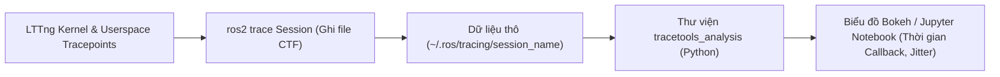

---
tags:
  - ros2
  - tracing
  - ros2_tracing
  - performance
  - lttng
  - latency-profiling
  - jupyter
  - advanced
created: 2026-08-25
aliases:
  - Giám sát và Phân tích Hiệu năng với ros2_tracing
  - How to use ros2_tracing to trace and analyze an application
---

# ⏱️ Giám sát và Phân tích Hiệu năng với ros2_tracing (Performance Profiling)

> [!INFO] **Mục tiêu bài học**
> Học phương pháp truy vết và đo kiểm hiệu năng mức hệ thống (**Low-overhead System Tracing**) bằng **`ros2_tracing`** dựa trên nền tảng **LTTng (Linux Trace Toolkit Next Generation)**: ghi lại thời điểm kích hoạt Callback, thời gian thực thi của Executor, và phân tích biểu đồ phân phối độ trễ trên **Jupyter Notebook**.
> - **Cấp độ:** Advanced
> - **Thời lượng ước tính:** 20 phút
> - **Mục lục tổng quan:** [[ROS 2 Learning Path]]
> - **Bài trước:** [[09 - Code Quality Assurance with Ament Lint CLI|Đảm bảo Chất lượng Mã nguồn với Ament Lint CLI]]
> - **Bài tiếp theo:** [[11 - Creating a Custom RMW Implementation|Xây dựng Tầng Middleware RMW Tùy biến]]

---

## 📖 Tại sao dùng Tracing thay vì In Log bằng `RCLCPP_INFO`?

1. **Độ trễ cực thấp (Sub-microsecond Overhead):** LTTng ghi trực tiếp sự kiện vào bộ nhớ Ring Buffer của nhân Linux với chi phí CPU gần như bằng $0$, không làm biến dạng hiệu năng của hệ thống thời gian thực.
2. **Theo dõi Toàn diện (End-to-End Pipeline):** Đo chính xác từng giai đoạn: *Publish $\to$ DDS Network $\to$ WaitSet $\to$ Executor $\to$ User Callback*.



---

## 🛠️ Quy trình Thực hiện Đo kiểm 3 Bước

### 1. Cài đặt các Gói Tracing
```bash
sudo apt update
sudo apt install -y babeltrace ros-humble-ros2trace ros-humble-tracetools-analysis
```

---

### 2. Thu thập Dữ liệu Trace (`ros2 trace`)

```bash
# Terminal 1: Bắt đầu phiên thu thập trace
ros2 trace --session-name perf-test --list
# Nhấn [Enter] để bắt đầu ghi

# Terminal 2: Chạy ứng dụng hoặc bài test robot cần đo đạc
ros2 run demo_nodes_cpp talker

# Terminal 1: Nhấn [Enter] để dừng và lưu trace vào ~/.ros/tracing/perf-test
```

Kiểm tra nhanh các sự kiện bằng lệnh `babeltrace`:
```bash
babeltrace ~/.ros/tracing/perf-test | less
```

---

### 3. Phân tích và Vẽ Đồ thị trên Jupyter Notebook

Sử dụng thư viện `tracetools_analysis` để tính toán thời gian thực thi của từng hàm Callback:

```python
from tracetools_analysis.loading import load_file
from tracetools_analysis.processor import Ros2Handler
from tracetools_analysis.utils.ros2 import Ros2DataModelUtil

# 1. Nạp file trace
events = load_file('~/.ros/tracing/perf-test')
handler = Ros2Handler.process(events)
data_util = Ros2DataModelUtil(handler.data)

# 2. Trích xuất thời lượng Callback của Subscription (tính bằng mili-giây)
callback_durations = data_util.get_subscription_callback_durations()

# 3. Vẽ biểu đồ Histogram phân phối độ trễ
import matplotlib.pyplot as plt
plt.plot(callback_durations)
plt.title("Thời gian thực thi Callback theo thời gian (ms)")
plt.xlabel("Mẫu số")
plt.ylabel("Thời gian (ms)")
plt.show()
```

---

## 📌 Tóm tắt (Summary)
- `ros2_tracing` là công cụ tối thượng để phát hiện hiện tượng giật lag (*Jitter*), xác định các điểm nghẽn cổ chai (*Bottlenecks*) và chứng minh độ trễ đáp ứng của hệ thống robot thời gian thực.

---

## 🔗 Liên kết & Bài tiếp theo
- ⬅️ Bài trước: [[09 - Code Quality Assurance with Ament Lint CLI|Đảm bảo Chất lượng Mã nguồn với Ament Lint CLI]]
- ➡️ Bài tiếp theo: [[11 - Creating a Custom RMW Implementation|Xây dựng Tầng Middleware RMW Tùy biến]]
