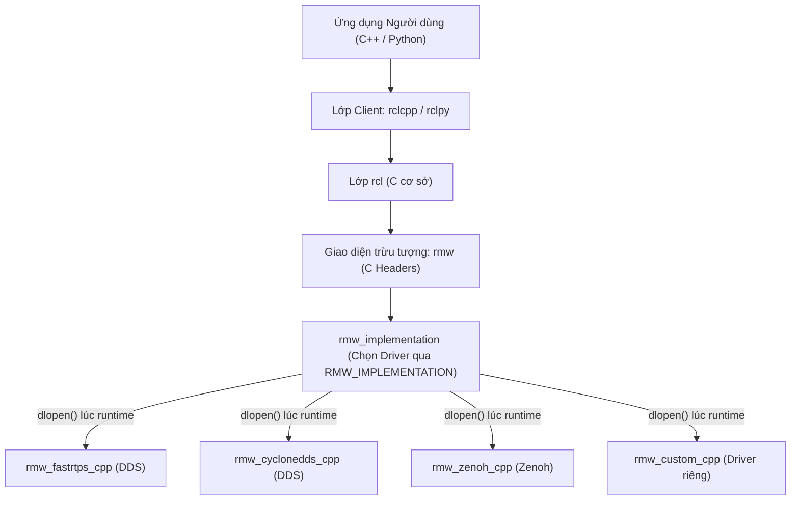

---
tags:
  - ros2
  - rmw
  - middleware
  - dds
  - zenoh
  - architecture
  - c-api
  - advanced
created: 2026-08-25
aliases:
  - Xây dựng Tầng Middleware RMW Tùy biến
  - Creating an rmw implementation
---

# 🔌 Xây dựng Tầng Middleware RMW Tùy biến (Custom RMW Implementation)

> [!INFO] **Mục tiêu bài học**
> Khám phá kiến trúc trừu tượng hóa tầng truyền thông sâu nhất của ROS 2 — **RMW (ROS Middleware Interface)**: hiểu cách thức `rmw_implementation` nạp động các thư viện qua `dlopen()` / `dlsym()`, hiện thực các hàm C API cốt lõi (**`rmw_publish`**, **`rmw_take`**, **`rmw_wait`**, **`wait sets`**), xử lý định danh thực thể toàn cầu (**GIDs**) và hỗ trợ hệ thống kiểu dữ liệu (**Type Support**).
> - **Cấp độ:** Advanced (Cực kỳ chuyên sâu)
> - **Thời lượng ước tính:** 30+ phút
> - **Mục lục tổng quan:** [[ROS 2 Learning Path]]
> - **Bài trước:** [[10 - Tracing and Performance Analysis with ros2_tracing|Giám sát và Phân tích Hiệu năng với ros2_tracing]]
> - **Phân hệ tiếp theo:** [[01 - Programmatic Bag Recording in C++ (rosbag2_cpp)|Ghi rosbag2 Trực tiếp từ Node C++]]

---

## 📖 Kiến trúc 2 Tầng Trừu tượng của ROS 2



---

## 🛠️ Các Trách nhiệm Cốt lõi của một RMW Implementation

Một triển khai RMW (như `rmw_fastrtps_cpp` hoặc `rmw_zenoh_cpp`) cần hiện thực các cơ chế sau:

### 1. Ánh xạ Tên Topic & Dịch vụ (Topic & Service Mangling)
Chuyển đổi quy ước đặt tên topic của ROS 2 sang cấu trúc của Middleware:
- Ví dụ trên DDS: topic `/chatter` được chuyển đổi thành `rt/chatter`.
- Dịch vụ (Service) trong DDS được xây dựng từ **2 topics song song**: một topic nhận yêu cầu (`rq/<service_name>Request`) và một topic trả kết quả (`rr/<service_name>Response`).

---

### 2. Cơ chế Chờ và Báo thức Executor (`Wait Sets` & `rmw_wait`)
Executor của ROS 2 không chủ động tốn CPU để thăm dò liên tục (*busy-looping*), mà dựa vào `rmw_wait()`:
- `rmw_wait()` nhận danh sách các Subscriptions, Service Servers, Service Clients và đưa vào **WaitSet**.
- Tiến trình sẽ đi ngủ (*sleep*) cho đến khi có ít nhất 1 gói tin mới đến trên socket mạng, sau đó đánh thức Executor để gọi Callback.

---

### 3. Lấy Dữ liệu (`rmw_take` & `rmw_take_with_info`)
Trích xuất gói tin và metadata kèm theo:
- **`GID` (Globally Unique Identifier):** Định danh duy nhất toàn cầu 16-byte của Publisher/Client.
- **`Source Timestamp` & `Received Timestamp`:** Mốc thời gian phát và nhận tin.
- **`Sequence Number`:** Số thứ tự gói tin để phát hiện mất mát.

---

### 4. Hệ thống Định kiểu Dữ liệu (Type Support)
Cầu nối giữa cấu trúc C++ của ROS 2 và bộ tuần tự hóa nhị phân của middleware (`rosidl_typesupport_c`, `rosidl_typesupport_cpp`).

---

## 🚀 Chuyển đổi RMW Động lúc Runtime

Người dùng có thể chuyển đổi toàn bộ giao thức mạng của hệ thống mà không cần biên dịch lại mã nguồn:

```bash
export RMW_IMPLEMENTATION=rmw_cyclonedds_cpp
ros2 run demo_nodes_cpp talker
```

---

## 📌 Tóm tắt (Summary)
- Tầng trừu tượng RMW mang lại cho ROS 2 khả năng thích ứng linh hoạt vô song: chạy được trên DDS (Fast DDS, Cyclone, Connext), giao thức IoT hiện đại (Zenoh), mạng chia sẻ bộ nhớ nội bộ (Shared Memory) hoặc bất kỳ hệ thống truyền tin tùy biến nào.

---

## 🔗 Liên kết & Bài tiếp theo
- ⬅️ Bài trước: [[10 - Tracing and Performance Analysis with ros2_tracing|Giám sát và Phân tích Hiệu năng với ros2_tracing]]
- 💾 Chuyển sang Phân hệ 9 (Advanced rosbag2): [[01 - Programmatic Bag Recording in C++ (rosbag2_cpp)|Ghi rosbag2 Trực tiếp từ Node C++]]
