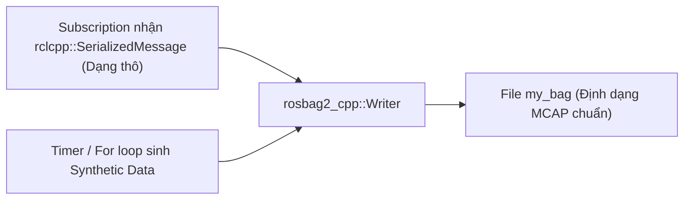

---
tags:
  - ros2
  - rosbag2
  - recording
  - cpp
  - serialized-message
  - synthetic-data
  - advanced
created: 2026-08-25
aliases:
  - Ghi rosbag2 Trực tiếp từ Node C++
  - Recording a bag from a node (C++)
---

# 💾 Ghi rosbag2 Trực tiếp từ Node C++ (Programmatic Bag Recording with C++)

> [!INFO] **Mục tiêu bài học**
> Học cách sử dụng thư viện **`rosbag2_cpp`** để ghi dữ liệu trực tiếp vào file bag ngay trong mã nguồn C++: ghi nhận thông điệp đã tuần tự hóa (**`rclcpp::SerializedMessage`**) mà không tốn chi phí giải mã, tạo topic lưu trữ động và sinh dữ liệu tổng hợp (**Synthetic Data Generation**) cho các bài toán huấn luyện AI/ML.
> - **Cấp độ:** Advanced
> - **Thời lượng ước tính:** 20 phút
> - **Mục lục tổng quan:** [[ROS 2 Learning Path]]
> - **Bài trước:** [[11 - Creating a Custom RMW Implementation|Xây dựng Tầng Middleware RMW Tùy biến]]
> - **Bài tiếp theo:** [[02 - Programmatic Bag Recording in Python (rosbag2_py)|Ghi rosbag2 Trực tiếp từ Node Python (rosbag2_py)]]

---

## 📖 Tại sao ghi Bag bằng Code C++ thay vì lệnh CLI `ros2 bag record`?

1. **Lưu trữ kết quả xử lý trung gian:** Bạn có thể vừa xử lý hình ảnh/điểm mây vừa ghi trực tiếp kết quả vào file bag mà không cần xuất bản qua một topic trung gian khác.
2. **Ghi tin nhắn tuần tự hóa nguyên bản (Zero De-serialization Overhead):** Nhận trực tiếp chuỗi byte nhị phân CDR (`SerializedMessage`) và đẩy thẳng vào ổ cứng.
3. **Sinh dữ liệu tổng hợp siêu tốc:** Tạo file bag chứa 100,000 mẫu tin chỉ trong 1 giây để giả lập kịch bản chạy thử nghiệm dài nhiều ngày.



---

## 🛠️ 3 Cách Ghi Bag trong C++

### Cách 1: Ghi thông điệp nhận được từ Subscription (`simple_bag_recorder.cpp`)

```cpp
#include <memory>
#include "rclcpp/rclcpp.hpp"
#include "std_msgs/msg/string.hpp"
#include "rosbag2_cpp/writer.hpp"

class SimpleBagRecorder : public rclcpp::Node
{
public:
  SimpleBagRecorder() : Node("simple_bag_recorder")
  {
    // 1. Tạo Writer và mở file bag (mặc định lưu định dạng MCAP)
    writer_ = std::make_unique<rosbag2_cpp::Writer>();
    writer_->open("my_bag");

    // 2. Callback nhận SerializedMessage giúp tối ưu hiệu năng tối đa
    auto callback = [this](std::shared_ptr<const rclcpp::SerializedMessage> msg) {
      rclcpp::Time timestamp = this->now();
      // Ghi trực tiếp chuỗi byte tuần tự hóa vào file
      writer_->write(msg, "chatter", "std_msgs/msg/String", timestamp);
    };

    subscription_ = this->create_subscription<std_msgs::msg::String>(
      "chatter", 10, callback
    );
  }

private:
  rclcpp::Subscription<std_msgs::msg::String>::SharedPtr subscription_;
  std::unique_ptr<rosbag2_cpp::Writer> writer_;
};
```

---

### Cách 2: Sinh Dữ liệu Giả lập Định kỳ bằng Timer (`data_generator_node.cpp`)

```cpp
#include <chrono>
#include "example_interfaces/msg/int32.hpp"
#include "rclcpp/rclcpp.hpp"
#include "rosbag2_cpp/writer.hpp"

using namespace std::chrono_literals;

class DataGenerator : public rclcpp::Node
{
public:
  DataGenerator() : Node("data_generator")
  {
    data_.data = 0;
    writer_ = std::make_unique<rosbag2_cpp::Writer>();
    writer_->open("timed_synthetic_bag");

    // Đăng ký trước thông tin topic với Writer
    writer_->create_topic({
      0u,
      "synthetic",
      "example_interfaces/msg/Int32",
      rmw_get_serialization_format(),
      {}, ""
    });

    // Timer mỗi 1 giây tự động ghi 1 mẫu tin
    timer_ = this->create_wall_timer(1s, [this]() {
      writer_->write(data_, "synthetic", this->now());
      ++data_.data;
    });
  }

private:
  rclcpp::TimerBase::SharedPtr timer_;
  std::unique_ptr<rosbag2_cpp::Writer> writer_;
  example_interfaces::msg::Int32 data_;
};
```

---

### Cách 3: Tạo Dữ liệu Nhanh với Vòng lặp For (`data_generator_executable.cpp`)

Tạo hàng loạt mẫu tin tức thời mà không cần chờ đồng hồ chạy theo thời gian thực:

```cpp
#include <chrono>
#include "example_interfaces/msg/int32.hpp"
#include "rclcpp/rclcpp.hpp"
#include "rosbag2_cpp/writer.hpp"

using namespace std::chrono_literals;

int main(int, char**)
{
  example_interfaces::msg::Int32 data;
  auto writer = std::make_unique<rosbag2_cpp::Writer>();
  writer->open("big_synthetic_bag");

  writer->create_topic({0u, "synthetic", "example_interfaces/msg/Int32", rmw_get_serialization_format(), {}, ""});

  rclcpp::Clock clock;
  rclcpp::Time timestamp = clock.now();

  // Tạo ngay 100 mẫu tin trải dài trong 100 giây chỉ trong vài mili-giây!
  for (int32_t i = 0; i < 100; ++i) {
    data.data = i;
    writer->write(data, "synthetic", timestamp);
    timestamp += rclcpp::Duration(1s);
  }

  return 0;
}
```

---

## 📌 Tóm tắt (Summary)
- Sử dụng C++ API `rosbag2_cpp::Writer` đem lại sự tự do tuyệt đối trong việc lưu trữ và khởi tạo dữ liệu mô phỏng cho robot.

---

## 🔗 Liên kết & Bài tiếp theo
- ⬅️ Bài trước: [[11 - Creating a Custom RMW Implementation|Xây dựng Tầng Middleware RMW Tùy biến]]
- ➡️ Phiên bản Python: [[02 - Programmatic Bag Recording in Python (rosbag2_py)|Ghi rosbag2 Trực tiếp từ Node Python (rosbag2_py)]]
