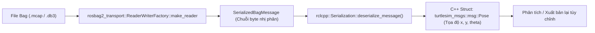

---
tags:
  - ros2
  - rosbag2
  - bag-reading
  - cpp
  - deserialization
  - playback
  - advanced
created: 2026-08-25
aliases:
  - Đọc Dữ liệu rosbag2 bằng C++
  - Reading from a bag file (C++)
---

# 📖 Đọc Dữ liệu rosbag2 bằng C++ (Programmatic Bag Reading with C++)

> [!INFO] **Mục tiêu bài học**
> Học cách sử dụng **`rosbag2_cpp`** và **`rosbag2_transport`** để đọc và trích xuất dữ liệu trực tiếp từ file bag trong C++: lặp qua các thông điệp với **`reader->has_next()`** và **`reader->read_next()`**, lọc topic cần lấy, giải tuần tự hóa (**Deserialization**) bằng `rclcpp::Serialization` và phát lại dữ liệu theo nhịp độ tùy ý.
> - **Cấp độ:** Advanced
> - **Thời lượng ước tính:** 15 phút
> - **Mục lục tổng quan:** [[ROS 2 Learning Path]]
> - **Bài trước:** [[02 - Programmatic Bag Recording in Python (rosbag2_py)|Ghi rosbag2 Trực tiếp từ Node Python (rosbag2_py)]]
> - **Bài tiếp theo:** [[04 - Programmatic Bag Reading in Python (rosbag2_py)|Đọc Dữ liệu rosbag2 bằng Python (rosbag2_py)]]

---

## 📖 Bối cảnh & Ứng dụng Thực tế

Thay vì phải chạy lệnh `ros2 bag play` để phát dữ liệu lên toàn bộ mạng ROS:
- Đọc trực tiếp file bag trong code C++ giúp bạn nạp dữ liệu lịch sử vào các thuật toán phân tích ngoại tuyến (*Offline Data Processing*), chạy thuật toán SLAM tái hiện bản đồ với tốc độ tối đa của CPU (*Faster-than-realtime Benchmarking*) hoặc trích xuất tọa độ để vẽ đồ thị.



---

## 🛠️ Triển khai mã nguồn C++ (`simple_bag_reader.cpp`)

```cpp
#include <chrono>
#include <iostream>
#include <memory>
#include <string>

#include "rclcpp/rclcpp.hpp"
#include "rclcpp/serialization.hpp"
#include "rosbag2_cpp/reader.hpp"
#include "rosbag2_storage/storage_options.hpp"
#include "rosbag2_transport/reader_writer_factory.hpp"
#include "turtlesim_msgs/msg/pose.hpp"

using namespace std::chrono_literals;

class PlaybackNode : public rclcpp::Node
{
public:
  PlaybackNode(const std::string & bag_filename)
  : Node("playback_node")
  {
    publisher_ = this->create_publisher<turtlesim_msgs::msg::Pose>("/turtle1/pose", 10);

    // 1. Cấu hình StorageOptions và mở file Bag
    rosbag2_storage::StorageOptions storage_options;
    storage_options.uri = bag_filename;
    reader_ = rosbag2_transport::ReaderWriterFactory::make_reader(storage_options);
    reader_->open(storage_options);

    // 2. Timer phát lại với tần số 10 Hz (100ms một mẫu tin)
    timer_ = this->create_wall_timer(100ms, std::bind(&PlaybackNode::timer_callback, this));
  }

private:
  void timer_callback()
  {
    // Lặp qua các bản tin trong file bag
    while (reader_->has_next()) {
      rosbag2_storage::SerializedBagMessageSharedPtr msg = reader_->read_next();

      // Chỉ lọc và xử lý các bản tin thuộc topic /turtle1/pose
      if (msg->topic_name != "/turtle1/pose") {
        continue;
      }

      // 3. Giải tuần tự hóa (Deserialization) chuỗi byte sang Struct C++
      rclcpp::SerializedMessage serialized_msg(*msg->serialized_data);
      auto ros_msg = std::make_shared<turtlesim_msgs::msg::Pose>();
      serialization_.deserialize_message(&serialized_msg, ros_msg.get());

      // 4. Xuất bản hoặc in kết quả ra màn hình
      publisher_->publish(*ros_msg);
      std::cout << "Đọc từ Bag: Vị trí Rùa (x=" << ros_msg->x << ", y=" << ros_msg->y << ")" << std::endl;

      break; // Phát xong 1 mẫu tin thì nhường quyền cho Timer kế tiếp
    }
  }

  rclcpp::TimerBase::SharedPtr timer_;
  rclcpp::Publisher<turtlesim_msgs::msg::Pose>::SharedPtr publisher_;
  rclcpp::Serialization<turtlesim_msgs::msg::Pose> serialization_;
  std::unique_ptr<rosbag2_cpp::Reader> reader_;
};

int main(int argc, char ** argv)
{
  if (argc != 2) {
    std::cerr << "Sử dụng: " << argv[0] << " <đường_dẫn_tới_file_bag>" << std::endl;
    return 1;
  }

  rclcpp::init(argc, argv);
  rclcpp::spin(std::make_shared<PlaybackNode>(argv[1]));
  rclcpp::shutdown();
  return 0;
}
```

---

## 📌 Tóm tắt (Summary)
- Sử dụng `rosbag2_transport::ReaderWriterFactory` giúp tự động nhận diện và đọc chuẩn xác mọi định dạng lưu trữ (MCAP, SQLite3) trong ROS 2.

---

## 🔗 Liên kết & Bài tiếp theo
- ⬅️ Bài trước: [[02 - Programmatic Bag Recording in Python (rosbag2_py)|Ghi rosbag2 Trực tiếp từ Node Python (rosbag2_py)]]
- ➡️ Phiên bản Python: [[04 - Programmatic Bag Reading in Python (rosbag2_py)|Đọc Dữ liệu rosbag2 bằng Python (rosbag2_py)]]
