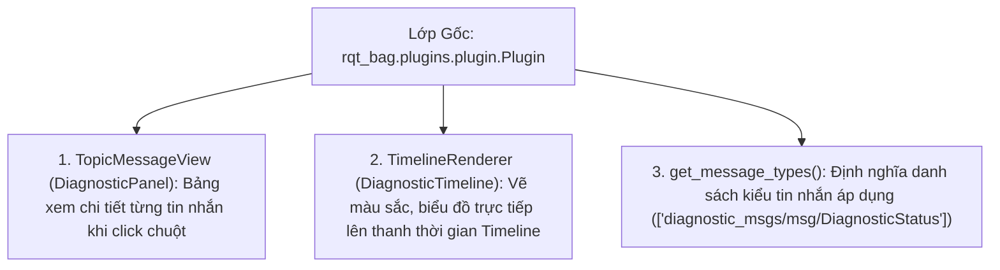

---
tags:
  - ros2
  - rqt
  - rqt_bag
  - plugins
  - python
  - qt
  - visualization
  - diagnostics
  - advanced
created: 2026-08-25
aliases:
  - Phát triển Plugin Tùy biến cho rqt_bag
  - Create an rqt_bag Plugin
---

# 🎞️ Phát triển Plugin Tùy biến cho rqt_bag (rqt_bag Custom Plugins)

> [!INFO] **Mục tiêu bài học**
> Học cách phát triển một **Plugin giao diện tùy biến cho rqt_bag** bằng Python và Qt (`python_qt_binding`): mở rộng lớp **`TopicMessageView`** để hiển thị bảng điều khiển trực quan chi tiết cho từng thông điệp, và kế thừa **`TimelineRenderer`** để vẽ thanh dòng thời gian màu sắc động (Xanh/Vàng/Đỏ) theo trạng thái chẩn đoán lỗi (`diagnostic_msgs/msg/DiagnosticStatus`).
> - **Cấp độ:** Advanced
> - **Thời lượng ước tính:** 20 phút
> - **Mục lục tổng quan:** [[ROS 2 Learning Path]]
> - **Bài trước:** [[04 - Programmatic Bag Reading in Python (rosbag2_py)|Đọc Dữ liệu rosbag2 bằng Python (rosbag2_py)]]

---

## 📖 3 Thành phần Cốt lõi của rqt_bag Plugin



---

## 🛠️ Triển khai mã nguồn Python (`the_plugin.py`)

### 1. Hiện thực Bảng Xem Chi tiết (`TopicMessageView`)
Vẽ hình tròn màu tương ứng với trạng thái (Xanh lá = OK, Vàng = Cảnh báo, Đỏ = Lỗi):

```python
from python_qt_binding.QtCore import Qt
from python_qt_binding.QtGui import QBrush, QPainter
from python_qt_binding.QtWidgets import QWidget
from rqt_bag import TopicMessageView
from diagnostic_msgs.msg import DiagnosticStatus

def get_color(diagnostic):
    if diagnostic.level == DiagnosticStatus.OK:
        return Qt.green
    elif diagnostic.level == DiagnosticStatus.WARN:
        return Qt.yellow
    return Qt.red

class DiagnosticPanel(TopicMessageView):
    name = 'Awesome Diagnostic'

    def __init__(self, timeline, parent, topic):
        super(DiagnosticPanel, self).__init__(timeline, parent, topic)
        self.widget = QWidget()
        parent.layout().addWidget(self.widget)
        self.msg = None
        self.widget.paintEvent = self.paintEvent

    def message_viewed(self, bag, entry, ros_message, msg_type_name, topic):
        # Kích hoạt khi người dùng nhấp vào một điểm trên Timeline
        self.msg = ros_message
        self.widget.update()

    def paintEvent(self, event):
        qp = QPainter()
        qp.begin(self.widget)
        rect = event.rect()
        if self.msg is None:
            qp.fillRect(0, 0, rect.width(), rect.height(), Qt.white)
        else:
            color = get_color(self.msg)
            qp.setBrush(QBrush(color))
            qp.drawEllipse(0, 0, rect.width(), rect.height())
        qp.end()
```

---

### 2. Hiện thực Vẽ Dòng Thời gian (`TimelineRenderer`)
Đọc dữ liệu nhị phân từ bag và tô màu từng đoạn thời gian tương ứng:

```python
from python_qt_binding.QtGui import QBrush, QPen
from rclpy.time import Time
from rclpy.serialization import deserialize_message
from rqt_bag import TimelineRenderer
from rqt_bag.bag_helper import to_sec

class DiagnosticTimeline(TimelineRenderer):
    def __init__(self, timeline, height=80):
        super().__init__(timeline, msg_combine_px=height)

    def draw_timeline_segment(self, painter: QPainter, topic, start: float, end: float, x: float, y: int, width: float, height: int):
        bag_timeline = self.timeline.scene()
        start_t = Time(seconds=start)
        end_t = Time(seconds=end)

        # Lấy tất cả các bản tin nằm trong đoạn thời gian [start, end]
        for bag, entry in bag_timeline.get_entries_with_bags([topic], start_t, end_t):
            topic, raw_data, t = bag_timeline.read_message(bag, entry.timestamp, topic)
            msg = deserialize_message(raw_data, DiagnosticStatus)
            color = get_color(msg)
            
            painter.setBrush(QBrush(color))
            painter.setPen(QPen(color, 5))

            t_float = to_sec(Time(nanoseconds=t))
            p_x = int(self.timeline.map_stamp_to_x(t_float))
            # Vẽ vạch màu tại vị trí thời gian tương ứng
            painter.drawLine(p_x, y, p_x, y + height - 1)
```

---

### 3. Đăng ký Lớp Plugin Chính (`DiagnosticBagPlugin`)

```python
from rqt_bag.plugins.plugin import Plugin

class DiagnosticBagPlugin(Plugin):
    def get_view_class(self):
        return DiagnosticPanel

    def get_renderer_class(self):
        return DiagnosticTimeline

    def get_message_types(self):
        return ['diagnostic_msgs/msg/DiagnosticStatus']
```

---

### 4. Khai báo Plugin trong `plugins.xml` và `package.xml`

Trong `plugins.xml`:
```xml
<library path=".">
  <class name="DiagnosticBagPlugin"
         type="rqt_bag_diagnostics_demo.the_plugin.DiagnosticBagPlugin"
         base_class_type="rqt_bag::Plugin">
    <description>Plugin trực quan hóa chẩn đoán trạng thái robot</description>
  </class>
</library>
```

Trong `package.xml`:
```xml
<export>
  <build_type>ament_python</build_type>
  <rqt_bag plugin="${prefix}/plugins.xml"/>
</export>
```

---

## 📌 Tóm tắt (Summary)
- Custom rqt_bag Plugin giúp biến các chuỗi log và dữ liệu thô phức tạp thành các biểu đồ trực quan sinh động, hỗ trợ đắc lực cho khâu phân tích sự cố robot sau khi vận hành.

---

## 🔗 Liên kết & Bài tiếp theo
- ⬅️ Trở về: [[ROS 2 Learning Path|Lộ trình học ROS 2 Tổng thể]]
- 🚀 Bạn đã hoàn thành xuất sắc toàn bộ các chủ đề từ Cơ bản, Trung cấp đến Chuyên sâu Cao cấp nhất của ROS 2!
