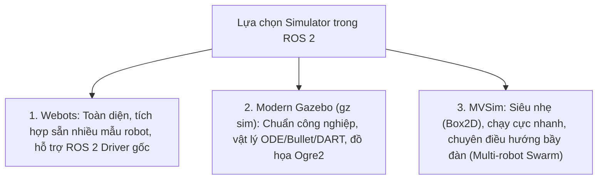

---
tags:
  - ros2
  - simulators
  - gazebo
  - webots
  - mvsim
  - robotics-simulation
  - advanced
created: 2026-08-25
aliases:
  - Tổng quan các Phần mềm Mô phỏng Robot trong ROS 2
  - Simulators in ROS 2
---

# 🌐 Tổng quan các Phần mềm Mô phỏng Robot trong ROS 2 (Simulators Overview)

> [!INFO] **Mục tiêu bài học**
> So sánh và lựa chọn phần mềm mô phỏng vật lý phù hợp cho dự án robot: **Webots** (Mạnh mẽ, dễ tiếp cận, hỗ trợ ROS 2 Native), **Modern Gazebo** (Chuẩn công nghiệp Open Robotics, đồ họa chân thực, tích hợp sâu) và **MVSim** (Siêu nhẹ, chuyên mô phỏng đa robot 2D/3D nhanh hơn thời gian thực).
> - **Cấp độ:** Advanced
> - **Thời lượng ước tính:** 15 phút
> - **Mục lục tổng quan:** [[ROS 2 Learning Path]]
> - **Bài tiếp theo:** [[02 - Webots Installation and Environment Setup|Cài đặt và Thiết lập Môi trường Webots với ROS 2]]

---

## 📖 Tại sao cần Mô phỏng Vật lý (Physics-Based Simulation)?

Khác với công cụ 2D đơn giản như `turtlesim`, các phần mềm mô phỏng hiện đại giải quyết bài toán tương tác vật lý thế giới thực:
1. **Trọng lực, Ma sát và Động lực học:** Robot chịu ảnh hưởng của mô-men quán tính, lực ma sát bánh xe với mặt đường và va chạm cứng.
2. **Cảm biến Chân thực (Realistic Sensor Models):** Mô phỏng tín hiệu quét Lidar 2D/3D, Camera RGB-D, IMU kèm nhiễu trắng (Gaussian Noise) và độ lệch (Bias Drift).
3. **Chuyển giao Không rủi ro (Sim-to-Real Transfer):** Kiểm thử thuật toán điều khiển Nav2, SLAM và tránh va chạm an toàn trước khi nạp vào phần cứng đắt tiền.

---

## 📊 Bảng So sánh Chi tiết 3 Nền tảng Mô phỏng

| Tiêu chí | Webots (`webots_ros2`) | Modern Gazebo (`gz sim`) | MVSim (`mvsim`) |
| :--- | :--- | :--- | :--- |
| **Engine Vật lý** | ODE (Open Dynamics Engine) | DART, Bullet, ODE, TRESTLE | Box2D (2D Rigid Body Physics) |
| **Độ phức tạp Đồ họa** | Đẹp mắt, chiếu bóng thực | Chân thực cao cấp (PBR, Ogre2) | 3D đơn giản hóa, rất nhẹ |
| **Tài nguyên phần cứng** | Trung bình | Yêu cầu GPU mạnh | **Cực nhẹ (Chạy tốt trên laptop yếu)** |
| **Mô phỏng Đa Robot** | Tốt | Tốt nhưng tốn tài nguyên | **Xuất sắc (Hàng chục robot song song)** |
| **Mục đích phù hợp nhất** | Tay máy, robot di động, giáo dục | Xe tự hành thực tế, bay drone, công nghiệp | Nghiên cứu thuật toán SLAM, Nav2, Swarm |

---

## 📌 Tóm tắt (Summary)
- Lựa chọn đúng simulator giúp đẩy nhanh tốc độ kiểm thử phần mềm robot gấp hàng chục lần và giảm thiểu chi phí thử nghiệm thực tế.

---

## 🔗 Liên kết & Bài tiếp theo
- ⬅️ Trở về: [[ROS 2 Learning Path|Lộ trình học ROS 2 Tổng thể]]
- ➡️ Bắt đầu với Webots: [[02 - Webots Installation and Environment Setup|Cài đặt và Thiết lập Môi trường Webots với ROS 2]]
