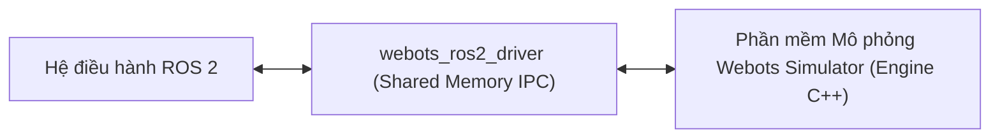

---
tags:
  - ros2
  - webots
  - installation
  - webots_ros2
  - environment-setup
  - advanced
created: 2026-08-25
aliases:
  - Cài đặt và Thiết lập Môi trường Webots với ROS 2
  - Webots Installation (Ubuntu)
---

# 🤖 Cài đặt và Thiết lập Môi trường Webots với ROS 2 (Webots Setup)

> [!INFO] **Mục tiêu bài học**
> Cài đặt gói giao tiếp **`webots_ros2`** trên Ubuntu, cấu hình các biến môi trường chỉ định đường dẫn Webots (**`WEBOTS_HOME`**, **`ROS2_WEBOTS_HOME`**) và khởi chạy các kịch bản mô phỏng đa robot mẫu (**`webots_ros2_universal_robot`**).
> - **Cấp độ:** Advanced
> - **Thời lượng ước tính:** 10 phút
> - **Mục lục tổng quan:** [[ROS 2 Learning Path]]
> - **Bài trước:** [[01 - Introduction to Simulators in ROS 2|Tổng quan các Phần mềm Mô phỏng Robot trong ROS 2]]
> - **Bài tiếp theo:** [[03 - Webots Basic Robot Simulation (Custom Driver Plugin)|Mô phỏng Robot Cơ bản trong Webots (Custom Driver Plugin)]]

---

## 📖 Cấu trúc Gói `webots_ros2`

Gói **`webots_ros2`** cung cấp cầu nối giao tiếp IPC (Inter-Process Communication) hiệu năng cao qua bộ nhớ chia sẻ (*Shared Memory*) giữa Webots và các node ROS 2:
- **`webots_ros2_driver`**: Node lõi chịu trách nhiệm nạp Webots và điều phối các plugin C++/Python kết nối tới robot.
- **`webots_ros2_control`**: Tích hợp với khung điều khiển chuẩn `ros2_control`.
- **`webots_ros2_msgs`**: Các định dạng dịch vụ chuyên dụng (như spawn node động, quay video hoạt họa).



---

## 🛠️ Cài đặt `webots_ros2` trên Ubuntu

Chạy lệnh cài đặt từ kho chính thức của ROS 2:

```bash
sudo apt update
sudo apt install -y ros-humble-webots-ros2
```

---

## 🔍 Thứ tự Tìm kiếm Đường dẫn Webots

Khi bạn khởi chạy một launch file ROS 2, `webots_ros2` sẽ tự động tìm kiếm phần mềm Webots theo thứ tự ưu tiên:
1. **Biến `ROS2_WEBOTS_HOME`**: Nếu được gán, ROS 2 sẽ sử dụng thư mục này bất kể phiên bản nào.
2. **Biến `WEBOTS_HOME`**: Đường dẫn cài đặt Webots tiêu chuẩn (ví dụ `/usr/local/webots`).
3. **Thư mục Mặc định**: Quét tại `/usr/local/webots` hoặc `/snap/webots/current/usr/share/webots`.
4. **Tự động tải về (Auto-download)**: Nếu máy tính chưa cài Webots, một cửa sổ popup sẽ xuất hiện cho phép bạn bấm nút để hệ thống tự động tải và cài đặt phiên bản tương thích mới nhất!

---

## 🚀 Khởi chạy Kịch bản Demo Mẫu

```bash
# Thiết lập đường dẫn Webots (nếu cài đặt ngoài thư mục mặc định)
export WEBOTS_HOME=/usr/local/webots

# Khởi chạy demo Universal Robot tay máy kết hợp xe tự hành
ros2 launch webots_ros2_universal_robot multirobot_launch.py
```

---

## 📌 Tóm tắt (Summary)
- `webots_ros2` mang lại trải nghiệm cài đặt và vận hành mô phỏng mượt mà với khả năng tự động phát hiện phiên bản Webots tương thích.

---

## 🔗 Liên kết & Bài tiếp theo
- ⬅️ Bài trước: [[01 - Introduction to Simulators in ROS 2|Tổng quan các Phần mềm Mô phỏng Robot trong ROS 2]]
- ➡️ Bài tiếp theo: [[03 - Webots Basic Robot Simulation (Custom Driver Plugin)|Mô phỏng Robot Cơ bản trong Webots (Custom Driver Plugin)]]
