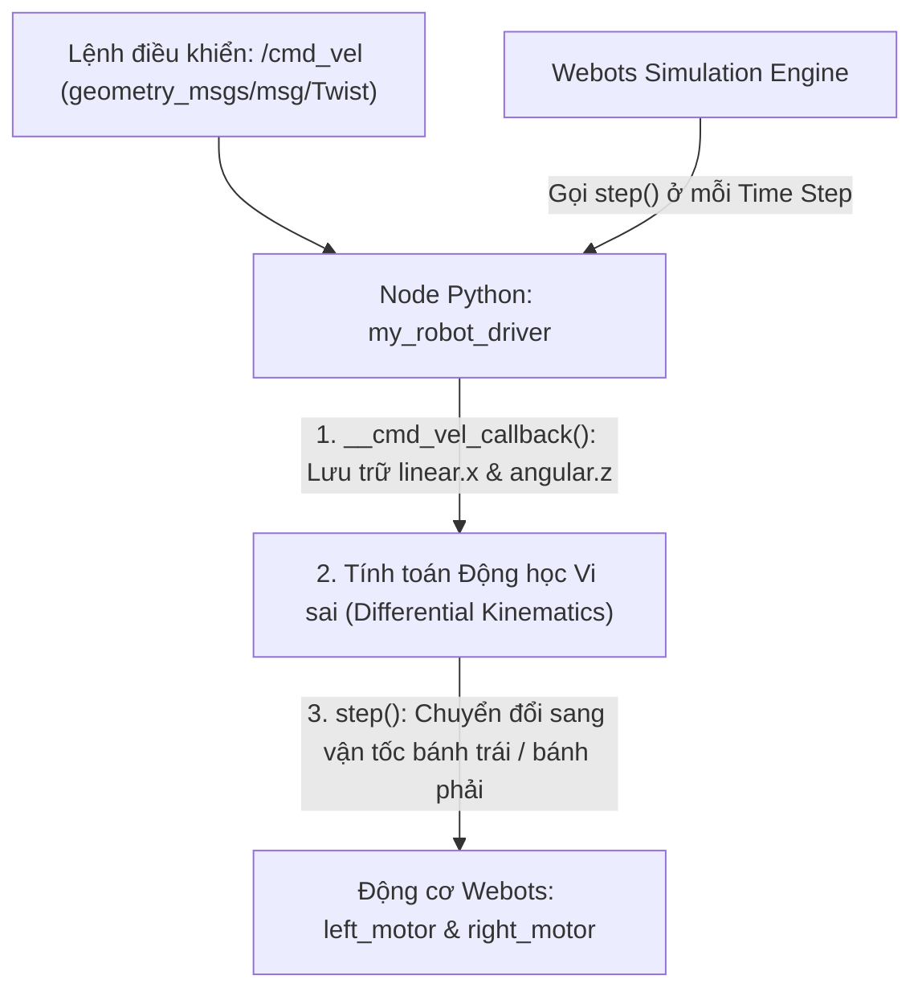

---
tags:
  - ros2
  - webots
  - simulation
  - webots_ros2_driver
  - python
  - differential-drive
  - cmd_vel
  - advanced
created: 2026-08-25
aliases:
  - Mô phỏng Robot Cơ bản trong Webots với Custom Driver Plugin
  - Setting up a robot simulation (Basic)
---

# 🤖 Mô phỏng Robot Cơ bản trong Webots với Custom Driver Plugin (Basic Webots Simulation)

> [!INFO] **Mục tiêu bài học**
> Học cách thiết lập một kịch bản mô phỏng hoàn chỉnh trong Webots và điều khiển từ ROS 2: tạo thế giới mô phỏng (**`my_world.wbt`**), viết Plugin điều khiển tùy biến bằng Python (**`MyRobotDriver`**) hiện thực 2 hàm vòng đời **`init()`** và **`step()`**, khai báo thẻ `<webots><plugin>` trong file URDF và khởi chạy đồng bộ với **`WebotsLauncher`** & **`WebotsController`**.
> - **Cấp độ:** Advanced
> - **Thời lượng ước tính:** 30 phút
> - **Mục lục tổng quan:** [[ROS 2 Learning Path]]
> - **Bài trước:** [[02 - Webots Installation and Environment Setup|Cài đặt và Thiết lập Môi trường Webots với ROS 2]]
> - **Bài tiếp theo:** [[04 - Webots Advanced Robot Simulation (Distance Sensors & Obstacle Avoidance)|Mô phỏng Nâng cao trong Webots (Cảm biến Khoảng cách & Tránh Vật cản)]]

---

## 📖 Cơ chế Hoạt động của Custom Driver Plugin



---

## 🛠️ Triển khai Chi tiết từng Bước

### 1. Tạo Package `my_package`
```bash
cd ~/ros2_ws/src
ros2 pkg create --build-type ament_python --license Apache-2.0 \
  --node-name my_robot_driver my_package \
  --dependencies rclpy geometry_msgs webots_ros2_driver

cd my_package
mkdir launch worlds resource
```

---

### 2. Viết Plugin Điều khiển Robot (`my_package/my_robot_driver.py`)

Plugin cần hiện thực 2 phương thức bắt buộc:
- **`init(self, webots_node, properties)`**: Khởi tạo thiết bị phần cứng của Webots và node ROS 2.
- **`step(self)`**: Được Webots gọi lặp lại ở mỗi bước thời gian của mô phỏng (*Simulation Timestep*).

```python
import rclpy
from geometry_msgs.msg import Twist

HALF_DISTANCE_BETWEEN_WHEELS = 0.045  # Nửa khoảng cách giữa 2 bánh (m)
WHEEL_RADIUS = 0.025                 # Bán kính bánh xe (m)

class MyRobotDriver:

    def init(self, webots_node, properties):
        # 1. Truy cập đối tượng Robot của Webots API
        self.__robot = webots_node.robot

        # 2. Lấy các thiết bị động cơ từ mô hình Webots
        self.__left_motor = self.__robot.getDevice('left wheel motor')
        self.__right_motor = self.__robot.getDevice('right wheel motor')

        # Cấu hình động cơ quay vô tận theo vận tốc (Velocity Control)
        self.__left_motor.setPosition(float('inf'))
        self.__left_motor.setVelocity(0.0)
        self.__right_motor.setPosition(float('inf'))
        self.__right_motor.setVelocity(0.0)

        self.__target_twist = Twist()

        # 3. Khởi tạo Node ROS 2 và đăng ký Subscription /cmd_vel
        rclpy.init(args=None)
        self.__node = rclpy.create_node('my_robot_driver')
        self.__node.create_subscription(Twist, 'cmd_vel', self.__cmd_vel_callback, 1)

    def __cmd_vel_callback(self, twist):
        self.__target_twist = twist

    def step(self):
        # 4. Cho phép Node ROS 2 xử lý sự kiện trong chu kỳ mô phỏng
        rclpy.spin_once(self.__node, timeout_sec=0)

        forward_speed = self.__target_twist.linear.x
        angular_speed = self.__target_twist.angular.z

        # 5. Phương trình động học vi sai (Differential Drive Kinematics)
        command_motor_left = (forward_speed - angular_speed * HALF_DISTANCE_BETWEEN_WHEELS) / WHEEL_RADIUS
        command_motor_right = (forward_speed + angular_speed * HALF_DISTANCE_BETWEEN_WHEELS) / WHEEL_RADIUS

        # 6. Gửi vận tốc góc (rad/s) xuống động cơ Webots
        self.__left_motor.setVelocity(command_motor_left)
        self.__right_motor.setVelocity(command_motor_right)
```

---

### 3. Khai báo Plugin trong URDF (`resource/my_robot.urdf`)

```xml
<?xml version="1.0" ?>
<robot name="My robot">
    <webots>
        <!-- Chỉ định đường dẫn tới class MyRobotDriver -->
        <plugin type="my_package.my_robot_driver.MyRobotDriver" />
    </webots>
</robot>
```

---

### 4. Viết Launch File (`launch/robot_launch.py`)

```python
import os
import launch
from ament_index_python.packages import get_package_share_directory
from launch import LaunchDescription
from webots_ros2_driver.webots_controller import WebotsController
from webots_ros2_driver.webots_launcher import WebotsLauncher

def generate_launch_description():
    package_dir = get_package_share_directory('my_package')
    robot_description_path = os.path.join(package_dir, 'resource', 'my_robot.urdf')

    # Khởi động trình mô phỏng Webots và nạp file thế giới
    webots = WebotsLauncher(
        world=os.path.join(package_dir, 'worlds', 'my_world.wbt')
    )

    # Khởi động WebotsController kết nối Plugin với robot trong mô phỏng
    my_robot_driver = WebotsController(
        robot_name='my_robot',
        parameters=[
            {'robot_description': robot_description_path},
        ]
    )

    return LaunchDescription([
        webots,
        my_robot_driver,
        # Tự động tắt toàn bộ ROS nodes khi đóng cửa sổ Webots
        launch.actions.RegisterEventHandler(
            event_handler=launch.event_handlers.OnProcessExit(
                target_action=webots,
                on_exit=[launch.actions.EmitEvent(event=launch.events.Shutdown())],
            )
        )
    ])
```

---

## 🚀 Thử nghiệm Điều khiển Robot

```bash
cd ~/ros2_ws
colcon build --symlink-install
source install/setup.bash

# Khởi chạy mô phỏng
ros2 launch my_package robot_launch.py
```

Mở terminal 2 và phát lệnh vận tốc:
```bash
ros2 topic pub /cmd_vel geometry_msgs/Twist "{linear: {x: 0.2}, angular: {z: 0.5}}"
```

Bạn sẽ thấy robot trong Webots bắt đầu di chuyển tiến về phía trước và bẻ lái quay vòng mượt mà theo đúng phương trình động học vi sai!

---

## 📌 Tóm tắt (Summary)
- `webots_ros2_driver` cho phép lập trình viên toàn quyền điều khiển phần cứng robot mô phỏng thông qua kiến trúc hướng sự kiện `init()` và `step()`.

---

## 🔗 Liên kết & Bài tiếp theo
- ⬅️ Bài trước: [[02 - Webots Installation and Environment Setup|Cài đặt và Thiết lập Môi trường Webots với ROS 2]]
- ➡️ Bài tiếp theo: [[04 - Webots Advanced Robot Simulation (Distance Sensors & Obstacle Avoidance)|Mô phỏng Nâng cao trong Webots (Cảm biến Khoảng cách & Tránh Vật cản)]]
