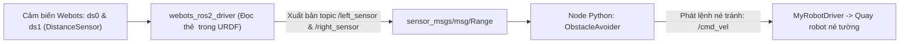

---
tags:
  - ros2
  - webots
  - distance-sensor
  - obstacle-avoidance
  - range-sensor
  - sensor_msgs
  - autonomous-navigation
  - advanced
created: 2026-08-25
aliases:
  - Mô phỏng Nâng cao trong Webots với Cảm biến Khoảng cách và Tránh Vật cản
  - Setting up a robot simulation (Advanced)
---

# 🛡️ Mô phỏng Nâng cao trong Webots (Cảm biến Khoảng cách & Tránh Vật cản)

> [!INFO] **Mục tiêu bài học**
> Mở rộng khả năng cảm nhận của robot trong Webots: cấu hình các thẻ **`<device>`** trong file URDF để tự động ánh xạ cảm biến khoảng cách (**`DistanceSensor`**) sang thông điệp **`sensor_msgs/msg/Range`**, và viết node **`ObstacleAvoider`** điều khiển robot tự hành né tường và chướng ngại vật theo thời gian thực.
> - **Cấp độ:** Advanced
> - **Thời lượng ước tính:** 20 phút
> - **Mục lục tổng quan:** [[ROS 2 Learning Path]]
> - **Bài trước:** [[03 - Webots Basic Robot Simulation (Custom Driver Plugin)|Mô phỏng Robot Cơ bản trong Webots (Custom Driver Plugin)]]
> - **Bài tiếp theo:** [[05 - Webots Reset Handler and Simulation Lifecycle|Xử lý Nút Reset và Vòng đời Mô phỏng trong Webots]]

---

## 📖 Cơ chế Tự động Ánh xạ Thiết bị Cảm biến trong `webots_ros2`

`webots_ros2_driver` tích hợp sẵn các plugin cho hầu hết mọi cảm biến trong Webots (Lidar, Camera, IMU, DistanceSensor, GPS). Bạn không cần phải tự viết code đọc từng byte dữ liệu cảm biến, mà chỉ cần khai báo thẻ **`<device>`** trong file URDF!



---

## 🛠️ Triển khai Nâng cấp Hệ thống

### 1. Cập nhật File URDF với thẻ `<device>` (`resource/my_robot.urdf`)

```xml
<?xml version="1.0" ?>
<robot name="My robot">
    <webots>
        <!-- 1. Cấu hình Cảm biến Khoảng cách Bên Trái -->
        <device reference="ds0" type="DistanceSensor">
            <ros>
                <topicName>/left_sensor</topicName>
                <alwaysOn>true</alwaysOn>
            </ros>
        </device>

        <!-- 2. Cấu hình Cảm biến Khoảng cách Bên Phải -->
        <device reference="ds1" type="DistanceSensor">
            <ros>
                <topicName>/right_sensor</topicName>
                <alwaysOn>true</alwaysOn>
            </ros>
        </device>

        <!-- Plugin điều khiển động cơ của chúng ta -->
        <plugin type="my_package.my_robot_driver.MyRobotDriver" />
    </webots>
</robot>
```

---

### 2. Viết Node Tự Động Tránh Vật Cản (`my_package/obstacle_avoider.py`)

```python
import rclpy
from geometry_msgs.msg import Twist
from rclpy.node import Node
from sensor_msgs.msg import Range

MAX_RANGE = 0.15  # Tầm quét tối đa của cảm biến (m)

class ObstacleAvoider(Node):

    def __init__(self):
        super().__init__('obstacle_avoider')

        # 1. Publisher phát lệnh vận tốc
        self.__publisher = self.create_publisher(Twist, 'cmd_vel', 1)

        # 2. Subscribers lắng nghe 2 cảm biến khoảng cách
        self.create_subscription(Range, 'left_sensor', self.__left_sensor_callback, 1)
        self.create_subscription(Range, 'right_sensor', self.__right_sensor_callback, 1)

        self.__left_sensor_value = MAX_RANGE
        self.__right_sensor_value = MAX_RANGE

    def __left_sensor_callback(self, message):
        self.__left_sensor_value = message.range

    def __right_sensor_callback(self, message):
        self.__right_sensor_value = message.range

        command_message = Twist()
        # Mặc định: Luôn tiến về phía trước với vận tốc 0.1 m/s
        command_message.linear.x = 0.1

        # Nếu một trong 2 cảm biến phát hiện tường ở khoảng cách gần (< 90% tầm tối đa)
        if self.__left_sensor_value < 0.9 * MAX_RANGE or self.__right_sensor_value < 0.9 * MAX_RANGE:
            # Bẻ lái quay tròn sang phải với tốc độ -2.0 rad/s để né tường
            command_message.angular.z = -2.0

        self.__publisher.publish(command_message)

def main(args=None):
    rclpy.init(args=args)
    avoider = ObstacleAvoider()
    rclpy.spin(avoider)
    avoider.destroy_node()
    rclpy.shutdown()

if __name__ == '__main__':
    main()
```

---

### 3. Cập nhật Launch File (`launch/robot_launch.py`)

Thêm node `obstacle_avoider` vào danh sách khởi chạy cùng Webots:

```python
    obstacle_avoider = Node(
        package='my_package',
        executable='obstacle_avoider',
    )

    return LaunchDescription([
        webots,
        my_robot_driver,
        obstacle_avoider,
        ...
    ])
```

---

## 🚀 Thử nghiệm Tự hành trong Webots

```bash
colcon build --symlink-install
source install/setup.bash
ros2 launch my_package robot_launch.py
```

- Nhấn phím tắt **`Ctrl + F10`** (hoặc vào menu `View -> Optional Rendering -> Show DistanceSensor Rays`) trong cửa sổ Webots để hiển thị các tia quét laser hồng ngoại của cảm biến.
- Quan sát robot di chuyển thẳng và tự động bẻ lái né tường một cách mượt mà không bao giờ bị đâm va!

---

## 📌 Tóm tắt (Summary)
- Sử dụng thẻ `<device>` trong URDF giúp bạn tích hợp hàng chục loại cảm biến phức tạp của Webots vào ROS 2 một cách hoàn toàn tự động và chuẩn hóa.

---

## 🔗 Liên kết & Bài tiếp theo
- ⬅️ Bài trước: [[03 - Webots Basic Robot Simulation (Custom Driver Plugin)|Mô phỏng Robot Cơ bản trong Webots (Custom Driver Plugin)]]
- ➡️ Bài tiếp theo: [[05 - Webots Reset Handler and Simulation Lifecycle|Xử lý Nút Reset và Vòng đời Mô phỏng trong Webots]]
