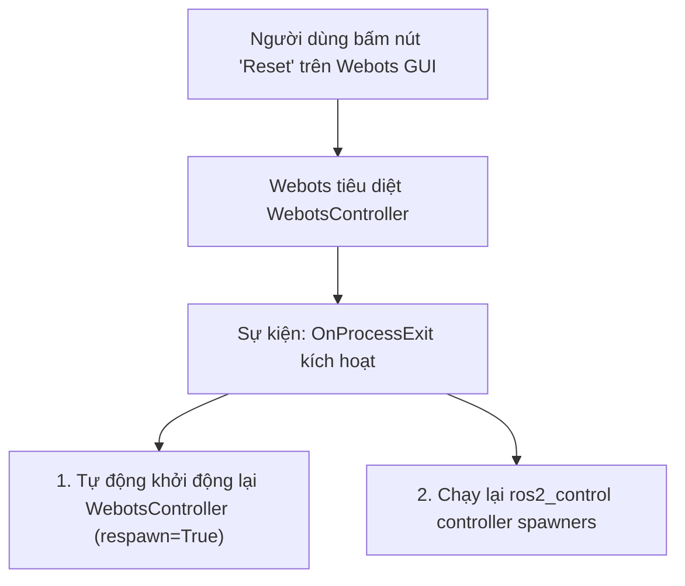

---
tags:
  - ros2
  - webots
  - reset-handler
  - lifecycle
  - respawn
  - ros2_control
  - event-handlers
  - advanced
created: 2026-08-25
aliases:
  - Xử lý Nút Reset và Vòng đời Mô phỏng trong Webots
  - Setting up a Reset Handler
---

# 🔄 Xử lý Nút Reset và Vòng đời Mô phỏng trong Webots (Reset Handler)

> [!INFO] **Mục tiêu bài học**
> Giải quyết triệt để vấn đề đồng bộ khi người dùng nhấn nút **Reset** trên giao diện Webots: tự động hồi sinh Driver Node với tham số **`respawn=True`**, thiết lập bộ xử lý sự kiện **`OnProcessExit`** để khởi động lại các tiến trình phụ trợ (**`ros2_control` spawners**) và quản lý vòng đời cho các hệ thống phức tạp như **Nav2** và **RViz2**.
> - **Cấp độ:** Advanced
> - **Thời lượng ước tính:** 15 phút
> - **Mục lục tổng quan:** [[ROS 2 Learning Path]]
> - **Bài trước:** [[04 - Webots Advanced Robot Simulation (Distance Sensors & Obstacle Avoidance)|Mô phỏng Nâng cao trong Webots (Cảm biến Khoảng cách & Tránh Vật cản)]]
> - **Bài tiếp theo:** [[06 - Webots Ros2Supervisor and Dynamic World Interaction|Node Ros2Supervisor và Tương tác Thế giới Động]]

---

## 📖 Thách thức khi Nhấn Nút "Reset" trong Webots

Trong Webots, khi bạn nhấn nút **Reset World (Ctrl + Shift + T)**:
1. Webots lập tức trả trạng thái các vật thể về vị trí ban đầu và **hủy diệt (kill) toàn bộ tiến trình điều khiển robot** đang kết nối qua IPC.
2. Tuy nhiên trong ROS 2, các node phụ trợ (như `ros2_control`, `nav2`, `robot_state_publisher`) vẫn đang chạy với dữ liệu cũ, dẫn đến mất đồng bộ hoàn toàn!



---

## 🛠️ 3 Chiến lược Xử lý Reset theo Mức độ Phức tạp

### 1. Trường hợp Cơ bản: Chỉ có Driver Node (`respawn=True`)

Chỉ cần bật cờ `respawn=True` trong `WebotsController`. Khi Webots tiêu diệt driver lúc reset, Launch System của ROS 2 sẽ tự động hồi sinh lại driver ngay lập tức:

```python
    robot_driver = WebotsController(
        robot_name='my_robot',
        parameters=[{'robot_description': robot_description_path}],
        respawn=True  # TỰ ĐỘNG HỒI SINH KHI SIMULATION RESET
    )
```

---

### 2. Trường hợp Đa Node: Tái khởi động `ros2_control` Spawners

Các node nạp controller (`controller_manager/spawner`) thoát ra sau khi chạy xong lúc launch. Khi reset, ta cần gọi lại hàm tạo spawner thông qua sự kiện `OnProcessExit`:

```python
import launch
from launch_ros.actions import Node

def get_ros2_control_spawners(*args):
    # Danh sách các node cần chạy lại mỗi khi reset
    return [
        Node(
            package='controller_manager',
            executable='spawner',
            arguments=['diffdrive_controller']
        )
    ]

def generate_launch_description():
    robot_driver = WebotsController(
        robot_name='my_robot',
        parameters=[{'robot_description': robot_description_path}],
        respawn=True
    )

    # Đăng ký Event Handler: Khi driver bị tắt do reset -> Chạy lại spawners
    reset_handler = launch.actions.RegisterEventHandler(
        event_handler=launch.event_handlers.OnProcessExit(
            target_action=robot_driver,
            on_exit=get_ros2_control_spawners,
        )
    )

    return LaunchDescription([
        webots,
        robot_driver,
        reset_handler
    ] + get_ros2_control_spawners())
```

---

### 3. Trường hợp Hệ thống Lớn (Nav2 / RViz2): Tách 2 Launch Files

Đối với các hệ thống phức tạp không hỗ trợ restart cục bộ (như Nav2), giải pháp chuẩn là **tách thành 2 tiến trình độc lập**:
1. **Launch File 1:** Chỉ chạy Webots.
2. **Launch File 2:** Chạy toàn bộ Robot Nodes + Nav2 + RViz2. Khi Webots reset làm driver tắt, Launch File 2 sẽ tự động Shutdown toàn bộ để người dùng bật lại sạch sẽ.

```python
    # Tự động đóng sạch sẽ toàn bộ hệ thống Nav2 khi bấm Reset trên Webots
    shutdown_handler = launch.actions.RegisterEventHandler(
        event_handler=launch.event_handlers.OnProcessExit(
            target_action=robot_driver,
            on_exit=[launch.actions.EmitEvent(event=launch.events.Shutdown())],
        )
    )
```

---

## 📌 Tóm tắt (Summary)
- Sử dụng `respawn=True` và `OnProcessExit` giúp trải nghiệm mô phỏng và kiểm thử thuật toán trên Webots diễn ra liên tục, tiết kiệm thời gian khởi động lại toàn bộ hệ thống.

---

## 🔗 Liên kết & Bài tiếp theo
- ⬅️ Bài trước: [[04 - Webots Advanced Robot Simulation (Distance Sensors & Obstacle Avoidance)|Mô phỏng Nâng cao trong Webots (Cảm biến Khoảng cách & Tránh Vật cản)]]
- ➡️ Bài tiếp theo: [[06 - Webots Ros2Supervisor and Dynamic World Interaction|Node Ros2Supervisor và Tương tác Thế giới Động]]
