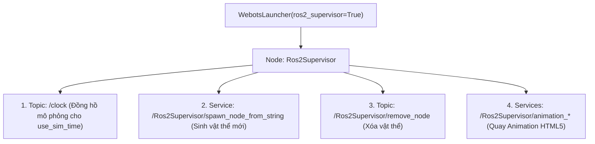

---
tags:
  - ros2
  - webots
  - supervisor
  - ros2supervisor
  - simulation-clock
  - dynamic-spawning
  - html5-animation
  - advanced
created: 2026-08-25
aliases:
  - Node Ros2Supervisor và Tương tác Thế giới Động
  - The Ros2Supervisor Node
---

# 🪄 Node Ros2Supervisor và Tương tác Thế giới Động (Webots Supervisor API)

> [!INFO] **Mục tiêu bài học**
> Làm chủ **`Ros2Supervisor`** — quyền năng tối cao của người quản trị thế giới ảo trong Webots: xuất bản đồng hồ thời gian mô phỏng (**`/clock`**) phục vụ `use_sim_time`, sinh/xóa động các vật thể hoặc robot mới trong khi mô phỏng đang chạy thông qua ROS 2 Services (**`spawn_node_from_string`**), và quay video hoạt họa tương tác **HTML5 3D Animations**.
> - **Cấp độ:** Advanced
> - **Thời lượng ước tính:** 15 phút
> - **Mục lục tổng quan:** [[ROS 2 Learning Path]]
> - **Bài trước:** [[05 - Webots Reset Handler and Simulation Lifecycle|Xử lý Nút Reset và Vòng đời Mô phỏng trong Webots]]
> - **Bài tiếp theo:** [[07 - Setting up Robot Simulation with Modern Gazebo|Mô phỏng Robot với Modern Gazebo (gz sim)]]

---

## 📖 Ros2Supervisor là gì? (What is Ros2Supervisor?)

**Supervisor (Người giám sát)** trong Webots là một thực thể đặc biệt có "quyền năng của Đấng sáng thế":
- Có thể dịch chuyển tức thời vị trí của bất kỳ vật thể nào (*Teleportation*).
- Thêm mới hoặc xóa bỏ các chướng ngại vật trong thời gian thực.
- Cung cấp nguồn thời gian chuẩn xác cho toàn bộ hệ thống ROS 2.



---

## 🛠️ Kích hoạt Ros2Supervisor trong Launch File

Chỉ cần đặt cờ `ros2_supervisor=True` trong `WebotsLauncher` và thêm `webots._supervisor` vào danh sách thực thi:

```python
from launch import LaunchDescription
from webots_ros2_driver.webots_launcher import WebotsLauncher

def generate_launch_description():
    webots = WebotsLauncher(
        world='/path/to/my_world.wbt',
        ros2_supervisor=True  # BẬT TÍNH NĂNG SUPERVISOR
    )

    return LaunchDescription([
        webots,
        webots._supervisor,  # ĐƯA SUPERVISOR NODE VÀO TIẾN TRÌNH
    ])
```

---

## 🚀 3 Ứng dụng Thực tế Quyền năng của Ros2Supervisor

### 1. Đồng bộ Thời gian Mô phỏng (`/clock`)
Ros2Supervisor tự động xuất bản thời gian Webots lên topic **`/clock`**. Bất kỳ node nào chạy với tham số `use_sim_time: true` sẽ đồng bộ hoàn hảo theo từng micro-giây của thế giới ảo, không bị lệch khi mô phỏng chạy nhanh hoặc chậm hơn thời gian thực.

---

### 2. Sinh Động Robot / Vật cản Mới từ Chuỗi Ký tự (Dynamic Spawning)
Gọi service `spawn_node_from_string` để thả một robot hoặc chiếc hộp vào thế giới ảo:

```bash
# Thả một robot mới tên 'imported_robot' vào thế giới đang chạy
ros2 service call /Ros2Supervisor/spawn_node_from_string \
  webots_ros2_msgs/srv/SpawnNodeFromString \
  "data: Robot { name \"imported_robot\" }"
```

Để xóa robot đó đi:
```bash
ros2 topic pub --once /Ros2Supervisor/remove_node std_msgs/msg/String "{data: imported_robot}"
```

---

### 3. Xuất Hoạt họa 3D HTML5 (Record Interactive 3D Web Animations)
Webots cho phép bạn xuất toàn bộ quá trình chạy thử nghiệm thành một file HTML5 tương tác xem trực tiếp trên trình duyệt Web (người xem có thể tự xoay góc nhìn 360 độ):

```bash
# 1. Bắt đầu ghi hoạt họa
ros2 service call /Ros2Supervisor/animation_start_recording \
  webots_ros2_msgs/srv/SetString "{value: \"/home/duyennh/simulation_demo/index.html\"}"

# 2. Dừng ghi và lưu file
ros2 service call /Ros2Supervisor/animation_stop_recording \
  webots_ros2_msgs/srv/GetBool "{ask: True}"
```

---

## 📌 Tóm tắt (Summary)
- `Ros2Supervisor` biến Webots thành một phòng thí nghiệm tự động hóa hoàn chỉnh: tự động sinh kịch bản thử nghiệm ngẫu nhiên (*Randomized Test Benches*) và ghi nhận kết quả không cần can thiệp thủ công.

---

## 🔗 Liên kết & Bài tiếp theo
- ⬅️ Bài trước: [[05 - Webots Reset Handler and Simulation Lifecycle|Xử lý Nút Reset và Vòng đời Mô phỏng trong Webots]]
- 🌐 Chuyển sang Gazebo: [[07 - Setting up Robot Simulation with Modern Gazebo|Mô phỏng Robot với Modern Gazebo (gz sim)]]
