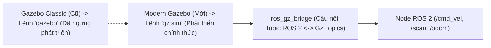

---
tags:
  - ros2
  - gazebo
  - gz-sim
  - ignition
  - ros_gz_bridge
  - physics-simulation
  - advanced
created: 2026-08-25
aliases:
  - Mô phỏng Robot với Modern Gazebo (gz sim)
  - Setting up a robot simulation (Gazebo)
---

# 🌍 Mô phỏng Robot với Modern Gazebo (Modern Gazebo & gz sim)

> [!INFO] **Mục tiêu bài học**
> Làm quen với **Modern Gazebo** (tên gọi chính thức hiện tại của **Ignition Gazebo**, thay thế hoàn toàn phiên bản Gazebo Classic cũ): hiểu quy tắc bắt cặp phiên bản theo chuẩn **REP-2000**, kiểm tra câu lệnh **`gz sim`** và thiết lập cầu nối dữ liệu hai chiều **`ros_gz_bridge`**.
> - **Cấp độ:** Advanced
> - **Thời lượng ước tính:** 15 phút
> - **Mục lục tổng quan:** [[ROS 2 Learning Path]]
> - **Bài trước:** [[06 - Webots Ros2Supervisor and Dynamic World Interaction|Node Ros2Supervisor và Tương tác Thế giới Động]]
> - **Bài tiếp theo:** [[08 - Getting Started with MVSim Simulator|Bắt đầu với Phần mềm Mô phỏng MVSim]]

---

## 📖 Sự chuyển dịch từ Gazebo Classic sang Modern Gazebo

Từ năm 2025, Open Robotics đã chính thức khai tử **Gazebo Classic (Gazebo 11)** để chuyển hoàn toàn sang thế hệ **Modern Gazebo** với kiến trúc đa mô-đun hiện đại:



---

## 📋 Bảng Bắt cặp Phiên bản theo Chuẩn ROS REP-2000

| Bản ROS 2 Distro | Bản Gazebo Mặc định tương ứng | Trạng thái |
| :--- | :--- | :---: |
| **ROS 2 Humble** | **Gazebo Fortress** (Ignition v6) hoặc **Harmonic** | Hỗ trợ LTS |
| **ROS 2 Iron** | **Gazebo Fortress** | Bản Stable |
| **ROS 2 Jazzy** | **Gazebo Harmonic** (Gz v8) | Hỗ trợ LTS mới nhất |
| **ROS 2 Rolling** | **Gazebo Harmonic** / **Ionic** | Phát triển liên tục |

---

## 🛠️ Kiểm tra Cài đặt Nhanh

Sau khi cài đặt gói mô phỏng, hãy kiểm tra công cụ dòng lệnh `gz sim`:

```bash
# Mở một thế giới mô phỏng rỗng
gz sim
```

Nếu một cửa sổ 3D hiện đại với bầu trời và lưới sàn xuất hiện, hệ thống của bạn đã sẵn sàng!

---

## 🌉 Cơ chế Cầu nối `ros_gz_bridge`

Trong khi Webots sử dụng IPC bộ nhớ chia sẻ trực tiếp trong driver, Modern Gazebo sử dụng gói cầu nối **`ros_gz_bridge`** để chuyển đổi qua lại giữa định dạng thông điệp của ROS 2 và Protobuf của Gazebo:

```bash
# Ví dụ cầu nối topic điều khiển vận tốc /cmd_vel
ros2 run ros_gz_bridge parameter_bridge /cmd_vel@geometry_msgs/msg/Twist@gz.msgs.Twist
```

---

## 📌 Tóm tắt (Summary)
- Modern Gazebo là tiêu chuẩn vàng của ngành công nghiệp robotics để mô phỏng các bài toán phức tạp đòi hỏi độ chính xác cao về tương tác vật lý.

---

## 🔗 Liên kết & Bài tiếp theo
- ⬅️ Bài trước: [[06 - Webots Ros2Supervisor and Dynamic World Interaction|Node Ros2Supervisor và Tương tác Thế giới Động]]
- 🏎️ Khám phá MVSim: [[08 - Getting Started with MVSim Simulator|Bắt đầu với Phần mềm Mô phỏng MVSim]]
