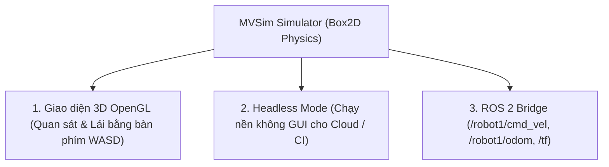

---
tags:
  - ros2
  - mvsim
  - multi-vehicle
  - simulator
  - box2d
  - lightweight
  - rviz2
  - headless
  - advanced
created: 2026-08-25
aliases:
  - Bắt đầu với Phần mềm Mô phỏng MVSim
  - Getting started with MVSim
---

# 🏎️ Bắt đầu với Phần mềm Mô phỏng MVSim (MVSim Multi-Vehicle Simulator)

> [!INFO] **Mục tiêu bài học**
> Làm quen với **MVSim (Multi-Vehicle Simulator)** — nền tảng mô phỏng robot di động siêu nhẹ mã nguồn mở dựa trên engine vật lý **Box2D**: khởi chạy độc lập (**Standalone CLI**) hoặc tích hợp **ROS 2 Node**, điều khiển xe vi sai/Ackermann, kiểm tra các topic `/cmd_vel`, `/odom`, `/tf`, hiển thị trên **RViz2** và chạy chế độ không màn hình (**Headless Mode**) cho máy chủ CI/CD.
> - **Cấp độ:** Advanced
> - **Thời lượng ước tính:** 20 phút
> - **Mục lục tổng quan:** [[ROS 2 Learning Path]]
> - **Bài trước:** [[07 - Setting up Robot Simulation with Modern Gazebo|Mô phỏng Robot với Modern Gazebo (gz sim)]]
> - **Bài tiếp theo:** [[09 - Defining MVSim Worlds, Vehicles, and Sensors|Định nghĩa Thế giới, Robot và Cảm biến trong MVSim]]

---

## 📖 MVSim là gì? (Why MVSim?)

Trong khi Gazebo và Webots tập trung vào độ chân thực vật lý 3D nặng nề, **MVSim** được thiết kế để giải quyết bài toán:
- **Tốc độ và Hiệu năng Siêu nhẹ:** Chạy hàng chục robot di động trên laptop cấu hình khiêm tốn hoặc máy chủ ảo không có GPU rời.
- **Mô phỏng Nhanh hơn Thời gian Thực (Faster-than-realtime):** Tăng tốc mô phỏng $5\times - 10\times$ để thu thập dữ liệu huấn luyện Reinforcement Learning hoặc chạy Test tự động.
- **Tích hợp ROS 2 Gốc:** Tự động tạo Namespace riêng (`/robot1`, `/robot2`) cho từng xe kèm theo cây tọa độ `/tf` tuân thủ chuẩn **REP-105** (`map -> odom -> base_link`).



---

## 🛠️ Cài đặt và Khởi chạy Nhanh

### 1. Cài đặt MVSim trên Ubuntu
```bash
sudo apt update
sudo apt install -y ros-humble-mvsim
```

---

### 2. Chạy Độc lập không cần ROS 2 (Standalone CLI)
Dùng để kiểm tra nhanh file thế giới `.world.xml`:

```bash
mvsim launch /opt/ros/humble/share/mvsim/mvsim_tutorial/demo_warehouse.world.xml
```
*Phím điều khiển:* Dùng phím **`W/A/S/D`** để lái xe, phím **`Space`** để phanh dừng lại.

---

### 3. Chạy Tích hợp cùng ROS 2 (ROS 2 Launch)

```bash
# Khởi chạy mô phỏng thế giới nhà kho
ros2 launch mvsim demo_warehouse.launch.py
```

Mở terminal khác kiểm tra danh sách topics:
```bash
ros2 topic list
```
Hệ thống sẽ sinh ra các topic chuẩn hóa:
- **`/robot1/cmd_vel`**: Nhận lệnh vận tốc `geometry_msgs/msg/Twist`.
- **`/robot1/odom`**: Dữ liệu Odometry từ Encoder bánh xe (`nav_msgs/msg/Odometry`).
- **`/robot1/base_pose_ground_truth`**: Vị trí tuyệt đối thực tế trong thế giới ảo.
- **`/robot1/laser1`**: Quét Laser 2D (`sensor_msgs/msg/LaserScan`).
- **`/robot1/lidar1_points`**: Đám mây điểm 3D (`sensor_msgs/msg/PointCloud2`).
- **`/tf` & `/tf_static`**: Ma trận tọa độ không gian.

---

## 🎮 Lái Robot bằng Bàn phím & Xem trên RViz2

### Lái xe qua ROS 2 Topic:
```bash
ros2 run teleop_twist_keyboard teleop_twist_keyboard --ros-args -r cmd_vel:=/robot1/cmd_vel
```

### Mở RViz2 hiển thị trực quan:
```bash
ros2 launch mvsim demo_warehouse.launch.py use_rviz:=True
```

---

## ☁️ Chế độ Chạy Không Màn hình (Headless Mode)

Khi chạy kiểm thử tự động trên Docker hoặc máy chủ Cloud không có card màn hình X11:

```bash
ros2 launch mvsim demo_warehouse.launch.py headless:=True
```

---

## 📌 Tóm tắt (Summary)
- MVSim là công cụ mô phỏng lý tưởng cho các nhà nghiên cứu và kỹ sư cần thử nghiệm nhanh thuật toán điều hướng bầy đàn đa robot mà không bị hạn chế bởi cấu hình phần cứng.

---

## 🔗 Liên kết & Bài tiếp theo
- ⬅️ Bài trước: [[07 - Setting up Robot Simulation with Modern Gazebo|Mô phỏng Robot với Modern Gazebo (gz sim)]]
- ➡️ Bài tiếp theo: [[09 - Defining MVSim Worlds, Vehicles, and Sensors|Định nghĩa Thế giới, Robot và Cảm biến trong MVSim]]
