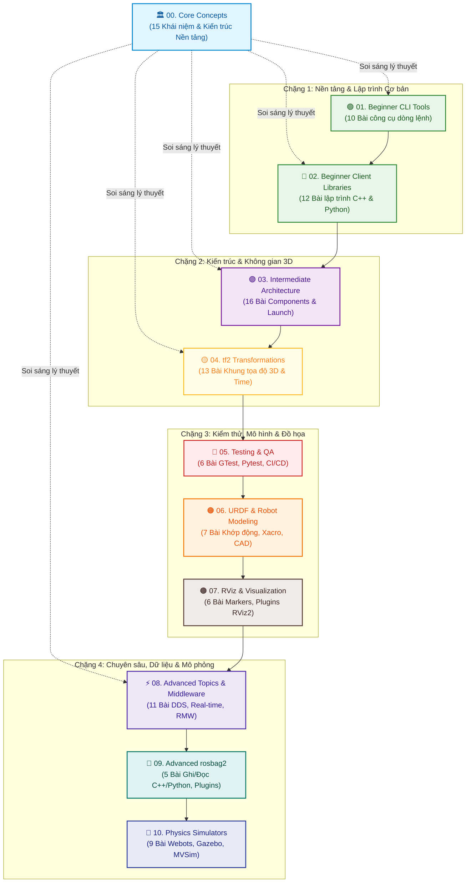

---
tags:
  - ros2
  - learning-path
  - moc
  - index
  - concepts
  - tutorials
created: 2026-08-25
aliases:
  - Lộ trình học ROS 2
  - ROS 2 Learning Path
---

# 🚀 Bản đồ Lộ trình học ROS 2 Toàn diện (Master ROS 2 Learning Path)

> [!INFO] **Tổng quan Kho Tri thức (Knowledge Base Overview)**
> **ROS 2 (Robot Operating System)** là hệ sinh thái phần mềm mã nguồn mở hàng đầu thế giới dành cho phát triển robot tự hành, cánh tay robot và các hệ thống điều khiển thông minh.
> 
> Vault Obsidian này gồm **110 Chuyên đề Kỹ thuật** được cấu trúc theo **11 Đại Phân Hệ** hoàn chỉnh: kết hợp chặt chẽ giữa **Lý thuyết Kiến trúc Cốt lõi (Core Concepts)** và **Thực hành Lập trình Chuyên sâu (Hands-on Tutorials)**.

- **Khu vực:** Toàn bộ hệ sinh thái ROS 2 Core, Architecture, Advanced Middleware, Tools & Simulators
- **Loại tài liệu:** Map of Content (MOC)
- **Tổng số chuyên đề:** 110 Bài học và Khái niệm Kiến trúc

---

## 🗺️ Sơ đồ Tổng thể Lộ trình Học (Master Pipeline)

---

## 📊 Bảng Tra cứu Nhanh 11 Đại Phân Hệ

| Phân hệ | Số lượng | Cấp độ | Trọng tâm Kiến thức |
| :--- | :---: | :---: | :--- |
| **[[#🏛️ 0 Core Concepts Khái niệm Cốt lõi & Kiến trúc Nền tảng\|00 - Core Concepts]]** | 15 bài | 📐 Nền tảng | Bản chất IDL, Nodes, Parameters, QoS, Executors, RMW, Zero-Copy GPU. |
| **[[#🟢 1 Beginner CLI Tools Bộ công cụ Dòng lệnh\|01 - Beginner CLI Tools]]** | 10 bài | 🟢 Cơ bản | Cấu hình ROS 2, Nodes, Topics, Services, Parameters, Actions, ros2 bag. |
| **[[#🔵 2 Beginner Client Libraries Lập trình C++ & Python\|02 - Beginner Client Libraries]]** | 12 bài | 🔵 Cơ bản | colcon, Workspace, Pub/Sub C++/Python, Custom Interfaces, pluginlib. |
| **[[#🟣 3 Intermediate Kiến trúc Nâng cao & Vận hành Hệ thống lớn\|03 - Intermediate]]** | 16 bài | 🟣 Trung cấp | Composable Nodes, Containers, Launch Systems sâu, Event Handlers. |
| **[[#🟡 4 tf2 Transformations Hệ thống Khung toạ độ Không gian 3D\|04 - tf2 Transformations]]** | 13 bài | 🟡 Trung cấp | Cây tọa độ tf2, Broadcasters/Listeners, Du hành thời gian, MessageFilter. |
| **[[#🔴 5 Testing & Quality Assurance Kiểm thử Tự động & Quản lý Chất lượng\|05 - Testing & QA]]** | 6 bài | 🔴 Trung cấp | colcon test, C++ GTest, Python Pytest, launch_testing, Build Farm CI. |
| **[[#🟠 6 URDF & Robot Modeling Mô hình Robot 3D & Động học\|06 - URDF & Modeling]]** | 7 bài | 🟠 Nâng cao | Visual/Collision URDF, Khớp động, Xacro Macros, CAD Exporters. |
| **[[#🟤 7 RViz & Visualization Trực quan hóa Đồ họa & Plugin Giao diện\|07 - RViz & Visualization]]** | 6 bài | 🟤 Nâng cao | 12 loại Markers RViz2, Custom Display Plugin, Custom Panel Plugin. |
| **[[#⚡ 8 Advanced Topics & Middleware Kiến trúc Chuyên sâu & Hiệu năng Cao\|08 - Advanced Topics]]** | 11 bài | ⚡ Chuyên sâu | Discovery Server, Real-time Allocator, Keyed Topics, RMW Layer. |
| **[[#💾 9 Advanced rosbag2 & Tooling Lưu trữ Dữ liệu Lập trình & Plugins\|09 - Advanced rosbag2]]** | 5 bài | 💾 Chuyên sâu | rosbag2 C++/Python API, Deserialization, Plugin rqt_bag tùy biến. |
| **[[#🤖 10 Simulators Mô phỏng Vật lý 3D & Đa Robot\|10 - Simulators]]** | 9 bài | 🤖 Chuyên sâu | Webots Driver/Supervisor, Modern Gazebo (`gz sim`), MVSim Box2D. |

---

## 📑 Chi tiết Danh mục Bài học theo Từng Phân Hệ

### 🏛️ 0. Core Concepts (Khái niệm Cốt lõi & Kiến trúc Nền tảng)
> [!NOTE] **Cơ sở lý thuyết vững chắc trước khi bước vào thực hành.**
1. [[01 - ROS 2 Interfaces (Topics, Services, Actions & IDL)|01. Khái niệm Giao diện Truyền thông (Topics, Services, Actions & IDL)]]
2. [[02 - Nodes, Execution Model and Distributed Discovery|02. Khái niệm Node và Cơ chế Tìm kiếm Phân tán trong ROS 2]]
3. [[03 - Parameters System and Dynamic Callbacks|03. Hệ thống Parameters và Cơ chế Callback Động trong ROS 2]]
4. [[04 - Quality of Service (QoS) Policies and Compatibility Matrix|04. Chất lượng Dịch vụ QoS và Bảng Ma trận Tương thích trong ROS 2]]
5. [[05 - Executors, Callback Groups and Scheduling Semantics|05. Kiến trúc Executors, Callback Groups và Ngữ nghĩa Lập lịch]]
6. [[06 - Component Composition and Container Architecture|06. Kiến trúc Ghép nối Components và Container trong ROS 2]]
7. [[07 - Client Libraries Architecture (rclcpp, rclpy, rcl)|07. Kiến trúc Thư viện Khách (rclcpp, rclpy và rcl Core)]]
8. [[08 - Logging Subsystem and Logger Configuration|08. Hệ thống Logging và Cấu hình Ghi Nhật ký trong ROS 2]]
9. [[09 - ROS 2 Domain ID and UDP Port Allocation Math|09. Công thức Tính toán Cổng UDP và Phân vùng ROS_DOMAIN_ID]]
10. [[10 - Middleware Vendors and RMW Architectures (DDS vs Zenoh)|10. Các Nhà cung cấp Middleware và Kiến trúc RMW (DDS vs Zenoh)]]
11. [[11 - SROS2 Security Framework and Enclaves|11. Khung Bảo mật SROS2 và Phân vùng An ninh Enclaves]]
12. [[12 - tf2 Geometric Transformation Principles|12. Nguyên lý Biến đổi Hình học và Cây Tọa độ tf2]]
13. [[13 - rosidl Buffer Backends and Zero-Copy Acceleration (GPU & NPU)|13. Tăng tốc Zero-Copy trên GPU/NPU với rosidl Buffer Backends]]
14. [[14 - ROS 2 Build System (ament, package.xml & colcon)|14. Hệ thống Biên dịch và Đóng gói (ament, package.xml và colcon)]]
15. [[15 - Internal ROS 2 APIs and Type Support Architecture|15. Kiến trúc API Nội bộ và Hệ thống Hỗ trợ Định kiểu Type Support]]

---

### 🟢 1. Beginner CLI Tools (Bộ công cụ Dòng lệnh)
1. [[01 - Configuring Environment|01. Cấu hình môi trường ROS 2 (Workspace, Underlay/Overlay, DOMAIN_ID)]]
2. [[02 - Using Turtlesim, ROS 2, and RQt|02. Làm quen với Turtlesim, ros2 CLI và RQt GUI]]
3. [[03 - Understanding Nodes|03. Tìm hiểu về Nodes trong ROS 2 (ROS Graph, Remapping)]]
4. [[04 - Understanding Topics|04. Tìm hiểu về Topics (Publish-Subscribe, QoS, echo, pub, hz, bw)]]
5. [[05 - Understanding Services|05. Tìm hiểu về Services (Request-Response, Service Call, Introspection)]]
6. [[06 - Understanding Parameters|06. Tìm hiểu về Parameters (Cấu hình Node, YAML Dump/Load)]]
7. [[07 - Understanding Actions|07. Tìm hiểu về Actions (Goal, Feedback, Result, Cancel/Abort)]]
8. [[08 - Using RQt Console|08. Quản lý và Kiểm tra Logs với RQt Console (5 Logger Levels)]]
9. [[09 - Launching Nodes|09. Khởi chạy nhiều Nodes với Launch Files cơ bản]]
10. [[10 - Recording and Playing Back Data|10. Ghi và Phát lại dữ liệu với ros2 bag (MCAP Storage)]]

---

### 🔵 2. Beginner Client Libraries (Lập trình C++ & Python)
1. [[01 - Using Colcon to Build Packages|01. Sử dụng colcon để build packages (--symlink-install, colcon_cd)]]
2. [[02 - Creating a Workspace|02. Tạo Workspace và Thiết lập Overlay (Giải quyết phụ thuộc với rosdep)]]
3. [[03 - Creating a Package|03. Tạo một Package trong ROS 2 (ament_cmake vs ament_python, package.xml)]]
4. [[04 - Writing PubSub (C++)|04. Viết Publisher và Subscriber bằng C++ (rclcpp::Node)]]
5. [[05 - Writing PubSub (Python)|05. Viết Publisher và Subscriber bằng Python (rclpy.node.Node)]]
6. [[06 - Writing Service Client (C++)|06. Viết Service và Client bằng C++ (rclcpp)]]
7. [[07 - Writing Service Client (Python)|07. Viết Service và Client bằng Python (rclpy)]]
8. [[08 - Creating Custom Interfaces (msg and srv)|08. Tạo Message (.msg) và Service (.srv) tùy chỉnh với rosidl]]
9. [[09 - Using Parameters in a Class (C++)|09. Sử dụng Parameters trong Class C++ (rclcpp)]]
10. [[10 - Using Parameters in a Class (Python)|10. Sử dụng Parameters trong Class Python (rclpy)]]
11. [[11 - Using ROS2 Doctor|11. Kiểm tra và Chẩn đoán hệ thống với ros2doctor]]
12. [[12 - Creating and Using Plugins (C++)|12. Tạo và Nạp động Plugins bằng C++ với pluginlib]]

---

### 🟣 3. Intermediate (Kiến trúc Nâng cao & Vận hành Hệ thống lớn)
1. [[01 - Managing Dependencies with rosdep|01. Quản lý Dependencies với rosdep (REP-149, rosdistro keys)]]
2. [[02 - Creating Custom Actions|02. Tạo Action tùy chỉnh (.action: Goal, Result, Feedback)]]
3. [[03 - Writing Action Server and Client (C++)|03. Viết Action Server và Client bằng C++ (rclcpp_action)]]
4. [[04 - Writing Action Server and Client (Python)|04. Viết Action Server và Client bằng Python (rclpy.action)]]
5. [[05 - Writing Async Node with asyncio (Python)|05. Viết Async Node thuần asyncio trong Python (AsyncNode)]]
6. [[06 - Writing a Composable Node (C++)|06. Viết Composable Node / Component bằng C++ (rclcpp_components)]]
7. [[07 - Composing Multiple Nodes in a Single Process|07. Kết hợp nhiều Node trong một Tiến trình (Component Containers, Zero-Copy)]]
8. [[08 - Using Node Interfaces Template Class (C++)|08. Sử dụng Node Interfaces Template Class (rclcpp::NodeInterfaces<>)]]
9. [[09 - Publishing Messages using YAML Files|09. Publish Message tuần tự qua File YAML]]
10. [[10 - Monitoring Parameter Changes (C++)|10. Theo dõi thay đổi Parameter trong C++ (ParameterEventHandler)]]
11. [[11 - Monitoring Parameter Changes (Python)|11. Theo dõi thay đổi Parameter trong Python (ParameterEventHandler)]]
12. [[12 - Creating a Launch File|12. Tạo Launch File chuyên sâu (XML, Python, Namespace, Mimic Remapping)]]
13. [[13 - Integrating Launch Files into ROS 2 Packages|13. Tích hợp Launch File vào Package (setup.py data_files / CMake install)]]
14. [[14 - Using Substitutions in Launch Files|14. Sử dụng Substitutions trong Launch File (find-pkg-share, var, env, eval)]]
15. [[15 - Using Event Handlers in Launch Files|15. Sử dụng Event Handlers trong Launch File (OnProcessStart, OnProcessExit)]]
16. [[16 - Managing Large Projects with Launch Files|16. Quản lý Dự án lớn với Launch Files: Kiến trúc Top-level, Wildcards, RViz2]]

---

### 🟡 4. tf2: Transformations (Hệ thống Khung toạ độ Không gian 3D)
1. [[01 - Introduction to tf2 and Static Broadcaster (Python)|01. Viết Static Broadcaster bằng Python (tf2_ros, static_transform_publisher)]]
2. [[02 - Writing a Static Broadcaster (C++)|02. Viết Static Broadcaster bằng C++ (tf2_ros::StaticTransformBroadcaster)]]
3. [[03 - Writing a Dynamic Broadcaster (Python)|03. Viết Dynamic Broadcaster bằng Python (TransformBroadcaster, tf2_echo)]]
4. [[04 - Writing a Dynamic Broadcaster (C++)|04. Viết Dynamic Broadcaster bằng C++ (tf2_ros::TransformBroadcaster)]]
5. [[05 - Writing a Listener (Python)|05. Viết tf2 Listener bằng Python (Buffer, lookup_transform, Follower Robot)]]
6. [[06 - Writing a Listener (C++)|06. Viết tf2 Listener bằng C++ (tf2_ros::TransformListener, lookupTransform)]]
7. [[07 - Adding Fixed and Dynamic Frames (Python)|07. Thêm Khung tọa độ Tĩnh và Động bằng Python (Cấu trúc Cây tf2 Tree)]]
8. [[08 - Adding Fixed and Dynamic Frames (C++)|08. Thêm Khung tọa độ Tĩnh và Động bằng C++ (Cấu trúc Cây tf2 Tree)]]
9. [[09 - Using Time and Timeouts in tf2 (C++)|09. Sử dụng Thời gian và Timeout trong tf2 (Giải mã lỗi Extrapolation)]]
10. [[10 - Time Travel with tf2 (C++)|10. Du hành Thời gian với tf2 trong C++ (Advanced 6-parameter lookupTransform)]]
11. [[11 - Quaternion Fundamentals in ROS 2|11. Cơ bản về Quaternion trong ROS 2 (Roll-Pitch-Yaw, Phép nhân quay, Inversion)]]
12. [[12 - Debugging tf2 Problems|12. Chẩn đoán và Debug lỗi tf2 (view_frames PDF, tf2_echo, tf2_monitor)]]
13. [[13 - Using Sensor Messages with MessageFilter (C++ & Python)|13. Xử lý Dữ liệu Cảm biến với tf2 MessageFilter (PointStamped, Lidar, Camera)]]

---

### 🔴 5. Testing & Quality Assurance (Kiểm thử Tự động & Quản lý Chất lượng)
1. [[01 - Why Automatic Tests in ROS 2|01. Tại sao cần Kiểm thử Tự động trong ROS 2? (9 Lợi ích chiến lược & Chi phí)]]
2. [[02 - Running Tests from Command Line|02. Chạy Kiểm thử từ Dòng lệnh với colcon (colcon test, colcon test-result)]]
3. [[03 - Writing Unit Tests with C++ and GTest|03. Viết Unit Test C++ với Google Test (ament_cmake_gtest, ASSERT/EXPECT)]]
4. [[04 - Writing Unit Tests with Python and Pytest|04. Viết Unit Test Python với Pytest (pytest, assert, setup.py)]]
5. [[05 - Writing Integration Tests with launch_testing|05. Viết Integration Test với launch_testing (Active & Post-shutdown Tests)]]
6. [[06 - Testing Code with the ROS Build Farm|06. Kiểm thử với ROS Build Farm (Jenkins CI/CD, PR Webhooks, rosdistro)]]

---

### 🟠 6. URDF & Robot Modeling (Mô hình Robot 3D & Động học)
1. [[01 - Building a Visual Robot Model from Scratch|01. Xây dựng Mô hình Robot Trực quan từ Đầu với URDF (Link, Joint, Mesh 3D)]]
2. [[02 - Building a Movable Robot Model|02. Xây dựng Khớp Động cho Robot trong URDF (Continuous, Revolute, Prismatic)]]
3. [[03 - Adding Physical and Collision Properties to URDF|03. Thêm Thuộc tính Vật lý và Va chạm vào URDF (Collision, Mass, Inertia Tensor)]]
4. [[04 - Using Xacro to Clean Up URDF Code|04. Sử dụng Xacro Tối ưu hóa Mã nguồn URDF (Properties, Math, Macros)]]
5. [[05 - Using URDF with robot_state_publisher (C++)|05. Sử dụng URDF với robot_state_publisher bằng C++ (State Publisher, TF Broadcast)]]
6. [[06 - Using URDF with robot_state_publisher (Python)|06. Sử dụng URDF với robot_state_publisher bằng Python (State Publisher, TF Broadcast)]]
7. [[07 - Exporting URDF from CAD and Tools|07. Xuất file URDF từ phần mềm CAD (SolidWorks, Fusion 360, OnShape, FreeCAD)]]

---

### 🟤 7. RViz & Visualization (Trực quan hóa Đồ họa & Plugin Giao diện)
1. [[01 - RViz User Guide and Core Concepts|01. Hướng dẫn Sử dụng RViz2 Toàn diện (Displays, Views, Fixed/Target Frames, Tools)]]
2. [[02 - Sending Basic Shape Markers to RViz (C++)|02. Gửi Marker Hình học Cơ bản lên RViz2 bằng C++ (Cube, Sphere, Arrow)]]
3. [[03 - Sending Points and Lines Markers to RViz (C++)|03. Vẽ Điểm và Đường thẳng với Marker trong C++ (POINTS, LINE_STRIP, Helix)]]
4. [[04 - RViz Marker Display Types Reference|04. Bảng Tra cứu Toàn bộ 12 Loại Marker trong RViz2 (Mesh Resource, Text Billboard)]]
5. [[05 - Building a Custom RViz Display Plugin (C++)|05. Tự Xây dựng Custom RViz Display Plugin trong C++ (MessageFilterDisplay, OGRE)]]
6. [[06 - Building a Custom RViz Panel Plugin (C++)|06. Tự Xây dựng Custom RViz Panel Plugin trong C++ (Qt GUI, Nút bấm & Subscriber)]]

---

### ⚡ 8. Advanced Topics & Middleware (Kiến trúc Chuyên sâu & Hiệu năng Cao)
1. [[01 - Supplementing Custom rosdep Keys|01. Bổ sung Custom rosdep Keys cho Thư viện Độc quyền (Custom sources.list.d, YAML)]]
2. [[02 - Enabling Topic Statistics (C++)|02. Bật và Đo lường Thống kê Topic bằng C++ (SubscriptionOptions, /statistics)]]
3. [[03 - DDS Keyed Topics in ROS 2|03. Cơ chế Phân loại Khóa Topic trong ROS 2 (IDL @key, Instance-based Durability)]]
4. [[04 - Topic Keys Subscription Filtering (Content Filtered Topics)|04. Lọc Nội dung Topic kết hợp Keyed Topics (Content Filtered Topics, SQL Filter)]]
5. [[05 - Fast DDS Discovery Server Architecture|05. Kiến trúc Fast DDS Discovery Server (Client-Server, Super Client, Redundancy)]]
6. [[06 - Unlocking Fast DDS XML Profiles and Features|06. Khai phá Sức mạnh Cấu hình XML trong Fast DDS (Sync/Async Mode, Partitions)]]
7. [[07 - Configuring Discovery Range and Static Peers|07. Cấu hình Phạm vi Discovery và Danh sách Static Peers (ROS_AUTOMATIC_DISCOVERY_RANGE)]]
8. [[08 - Implementing Custom Real-Time Memory Allocator (C++)|08. Tự Triển khai Memory Allocator Thời gian Thực trong C++ (std::pmr, TLSF Allocator)]]
9. [[09 - Code Quality Assurance with Ament Lint CLI|09. Đảm bảo Chất lượng Mã nguồn với Ament Lint CLI (cppcheck, cpplint, uncrustify)]]
10. [[10 - Tracing and Performance Analysis with ros2_tracing|10. Giám sát và Phân tích Hiệu năng với ros2_tracing (LTTng, tracetools_analysis)]]
11. [[11 - Creating a Custom RMW Implementation|11. Xây dựng Tầng Middleware RMW Tùy biến (dlopen/dlsym, Wait Sets, Type Support)]]

---

### 💾 9. Advanced rosbag2 & Tooling (Lưu trữ Dữ liệu Lập trình & Plugins)
1. [[01 - Programmatic Bag Recording in C++ (rosbag2_cpp)|01. Ghi rosbag2 Trực tiếp từ Node C++ (rosbag2_cpp::Writer, SerializedMessage)]]
2. [[02 - Programmatic Bag Recording in Python (rosbag2_py)|02. Ghi rosbag2 Trực tiếp từ Node Python (SequentialWriter, MCAP, Synthetic Data)]]
3. [[03 - Programmatic Bag Reading in C++ (rosbag2_transport)|03. Đọc Dữ liệu rosbag2 bằng C++ (rosbag2_transport, Deserialization)]]
4. [[04 - Programmatic Bag Reading in Python (rosbag2_py)|04. Đọc Dữ liệu rosbag2 bằng Python (SequentialReader, Data Processing, ML Pipeline)]]
5. [[05 - Developing Custom rqt_bag Plugins (Python)|05. Phát triển Plugin Tùy biến cho rqt_bag (TopicMessageView, TimelineRenderer)]]

---

### 🤖 10. Simulators (Mô phỏng Vật lý 3D & Đa Robot)
1. [[01 - Introduction to Simulators in ROS 2|01. Tổng quan các Phần mềm Mô phỏng Robot trong ROS 2 (Webots, Modern Gazebo, MVSim)]]
2. [[02 - Webots Installation and Environment Setup|02. Cài đặt và Thiết lập Môi trường Webots với ROS 2 (webots_ros2, WEBOTS_HOME)]]
3. [[03 - Webots Basic Robot Simulation (Custom Driver Plugin)|03. Mô phỏng Robot Cơ bản trong Webots (Custom Driver Plugin, init, step)]]
4. [[04 - Webots Advanced Robot Simulation (Distance Sensors & Obstacle Avoidance)|04. Mô phỏng Nâng cao trong Webots (Cảm biến Khoảng cách thẻ <device> & Tránh Vật cản)]]
5. [[05 - Webots Reset Handler and Simulation Lifecycle|05. Xử lý Nút Reset và Vòng đời Mô phỏng trong Webots (respawn=True, OnProcessExit)]]
6. [[06 - Webots Ros2Supervisor and Dynamic World Interaction|06. Node Ros2Supervisor và Tương tác Thế giới Động (/clock, spawn_node, HTML5 Animations)]]
7. [[07 - Setting up Robot Simulation with Modern Gazebo|07. Mô phỏng Robot với Modern Gazebo (gz sim, ros_gz_bridge, REP-2000)]]
8. [[08 - Getting Started with MVSim Simulator|08. Bắt đầu với Phần mềm Mô phỏng MVSim (Box2D Physics, Standalone CLI, RViz2)]]
9. [[09 - Defining MVSim Worlds, Vehicles, and Sensors|09. Định nghĩa Thế giới, Robot và Cảm biến trong MVSim (.world.xml, Ackermann, IMU Noise)]]
